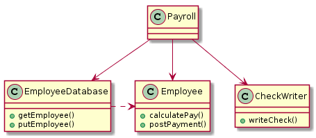
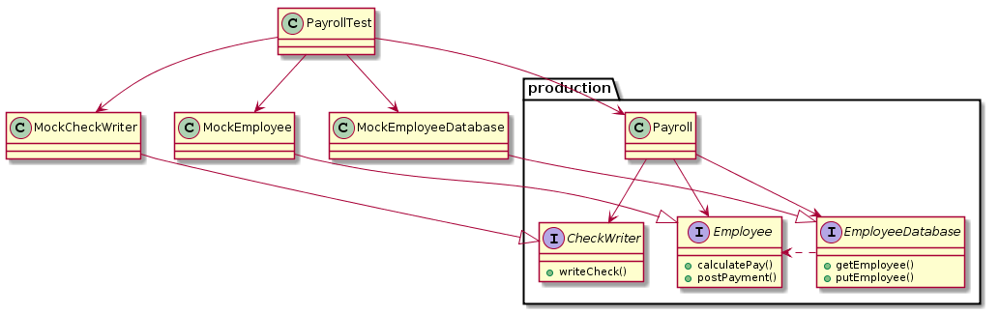
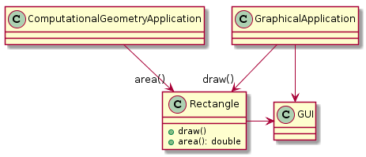
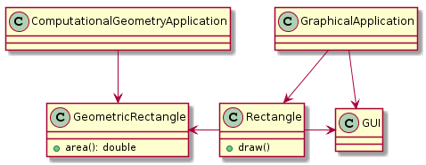
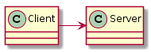
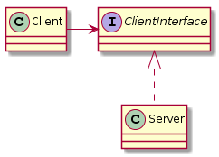
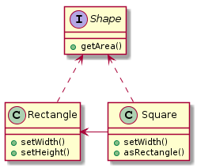
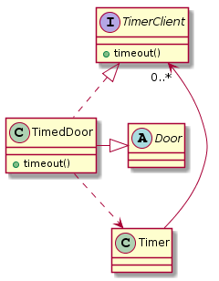

# 클린 소프트웨어

## 1. 애자일 실천방법(practice)

### 계속되는 악순환

- 많은 프로젝트가 실천방법 없이 프로젝트를 진행한다.
- 그로 인해 실패를 경험하게 되고 결과물을 요구하는 프로세스가 생긴다.
- 하지만 까다롭고 많은 프로세스는 오히려 복잡하게 만드는 계속되는 악순환 이 생긴다.
	- 이는 소프트웨어 위기 와 연결된다.
- 아이러니 하게도 위와 같은 프로세스를 채택하는 회사가 빠르게 늘어낫다 - 큰 회사일 수록 더 심함

### 애자일 연합
#### 애자일 소프트웨어 개발 선언문
- 프로세스와 툴보다 개인과 상호작용이우선이다.
	- 프로그래밍 실력은 평범하지만 서로 잘 대화하는 팀이 성공할 가능성이 높다.
	- 팀을 만들기 위해 노력하고 그런 뒤에 팀의 필요를 기반으로 환경을 구축하자.
- 포괄적인 문서보다 동작하는 소프트웨어가 우선이다.
	- 설계 원리와 구조에 대한 문서를 쓰고 유지하되, 짧고 요약적 이어야 한다.
	- 그 필요가 급박하고 중요하지 않다면 아무 문서도 만들지 마라
- 계약 협상보다 고객 협력이 우선이다.
	- 자주 고객의 피드백을 받아야 한다.
	- 하지만 일반적인 갑을 관계에서 고객 협력이 우선되면 그로 인한 피해는 어떻게 해야할까?
- 계획에 따르는 것 보다 변화에 대한 반응이 우선이다
	- 우선순위 변경에 따라서 변화가 우선한 경우에는 이에 따라야 하는 것이 우선이다.
	- 계약 협상보다 고객 협력이 우선이다 와 연결되는 내용인 것 같다.

### 원칙
- 우리의 최고 가치는 유용한 소프트웨의 빠르고 지속적인 공개를 통해 고객을 만족시키는 것이다.
	- 첫 공개본에서 기능하는 부분이 적을수록 최종 공개본의 품질이 높이진다. : ?? 하지만 애자일에는 위배되는 것 같다.
	- 자주 공개할 수록 최종 품질도 좋았다. - OK
- 개발 후반부에 접어들었다 할지라도, 요구사항 변경을 환영하라
	- 팀은 소프트웨어의 구조를 탄력적으로 유지하기 위해서 노력한다.
- 개발 중인 소프트웨어를 자주 공개하라
	- 2주에서 2달사이, 혹은 더 짧은 시간 간격으로
- 업무를 하는 사람과 개발자는 계속 함께 일해야 한다.
- 의욕적인 개인들을 중심으로 프로젝트를 구성하라. 환경과 필요로 하는 지원을 제공하고 그들이 그 일을 해낼 것이라 믿고 맡겨둬라.
- 개발 팀 내에서 정보를 전달하고 옹유하는 가장 효율적이고 효과적인 방법은 직접 일대일로 대화하는 것이다.
- 개발 중인 소프트웨어가 진척 상황의 일차적 척도다.
- 애자일 프로세스는 지속 가능한 개발을 촉진한다. 스폰서, 개발자, 사용자는 무한히 지속적인 pace를 유지할 수 있어야 한다.
	- 애자일 프로젝트는 마라톤이다.
- 우수 기술과 좋은 설계에 대한 지속적인 관심은 속도를 향상한다.
- 단순성(아직 끝내지 않은 일의 양을 최대화하는 예술)은 필수적이다.
- 최고의 아키텍쳐, 요구사항, 설계는 자기 조직적인 팀에서 나온다.
- 규칙적으로 팀은 좀 더 효과적인 방법을 반영해야 하고, 적절히 그 행위를 조율하고 조정해야 한다.

> 프로세스가 늘어나는 악순환은 실패의 원인이다. 애자일은 간단한 테크닉에 초점을 맞추는 것을 돕기 위한 방법으로서 만들어졌다.

## 2. 익스트림 프로그래밍 소개

### XP 실천방법
#### 고객 팀 구성원
- 고객도 팀의 일원이여야 한다.

#### 사용자 스토리
- 현재 진행 중인 요구사항에 관한 대화의 연상 기호
- 고객이 우선순위와 추정 비용에 근거해 요구사항의 구현 일정을 구립하게 해주는 계획 툴

#### 짧은 반복
XP 프로젝트는 일반적으로 개발 중인 소프트웨어를 2주마다 공개한다.

- 반복 계획 : Minor delivery : 보통 2주
- 릴리즈 계획 : Major delivery : Iteration(2주) * 6 = 보통 3개월

#### 인수 테스트

#### 짝 프로그래밍
- 짝 프로그래밍을 하면 당장 투입되는 시간은 늘어나지만 그로 인해서 결함이 적고 더 나은 프로그램을 만들 수 있어서 전체적으로 효율성은 좋아진다.
- 누군가 짝 프로그래밍을 요구하면 거부할 수 없다.

#### TDD
- 회귀테스트를 가능하게 한다.
- 리팩토링을 용이하게 한다.
- 설계에 도움을 준다. - 일례로 결합도가 낮아짐

#### 공동 소유권
- 도메인이나 구조 별로 담당자를 특별하게 구분하지 않는다.

#### CI(지속적 통합)
1. 언제나 편하게 코드를 check-in(push), check-out(pull) 할 수 있어야한다.
2. 하루에도 여러 번 처음부터 끝까지 전체 시스템을 빌드 한다.

#### 지속 가능한 속도
소프트웨어 프로젝트는 마라톤이다.

#### 열린 작업 공간
팀 내 소통은 언제나 열려 있어야 한다.

#### 계획 세우기 게임
짧은 반복을 통해서 프로젝트 리듬에 익숙해 지면 사용자 스토리에 대해서 빠르게 기간과 비용을 측정할 수 있게 된다.

#### 단순한 설계
최대한 단순하게 요구사항을 구현한다. 만약 요구사항이 필요로 할 때만 인프라가 추가된다.
- 어떻게든 동작하는 가장 단순한 것을 생각한다.
- 필요하지 않을 것이라는 가정에서 시작한다.
- 코드를 중복해서 쓰지 않는다.

#### 리팩토링
- 코드는 부패하기 쉽다(Bad smell)
- 언제나 잦은 리팩토링으로 이를 극복해야 한다.

#### 메타포
- 사전적으로는 은유 또는 비유
- 전체 시스템을 하나로 묶는 큰 그림
ex) 버퍼 시스템

#### 쓰레기를 운반하는 덤프트럭

## 3. 계획 세우기
### 초기 탐색
사용자 스토리에 포인트를 할당해서 가능한 객관적으로 구현에 필요한 시간을 확인할 수 있다.

#### 스파이크, 분할, 속도
적정 포인트로 사용자 스토르를 분할 또는 취합해야 한다.

스토리의 정확한 크기를 알기 위해서는 속도(Velocity)라는 요소가 필요하다.

- 예를 들어 속도가 ‘스토리 포인트당 2일’이고 어떤 스토리가 상대적인 추정결과 4개의 포인트를 갖는다면 그 스토리를 구현하는 데는 8일 이 걸릴 것이다.
스파이크 : 대개 며칠만 투자해도 한 두개의 스토리로 프로토타입을 만들어보면서 팀의 속도를 알 수 있다. 이런 프로토타입 단계를 스파이크라 한다.

#### 릴리즈 계획 세우기
속도(Velocity)가 파악되면 릴리즈 계획을 세울 수 있다. 보통 3달로 한다.

#### 반복 계획 세우기
- 보통 2주가 된다.
- 스토리를 우선순위는 기술적 결정, 즉 개발자가 정한다.
- 모든 계획된 스토리가 구현되지 않더라도 반복은 정해진 날짜에 끝난다.
	- 미완료 된 기능은 다음 반복으로 미루는 것이 가능하지만 가능하면 계획에 맞춰서 끝내도록 노력해야 한다.
- 반복 별로 사용되는 스토리 포인트는 일정해야 한다.

#### 태스크 계획 세우기
- 사용자 스토리 = 태스크 * N
- 1 태스크 = 4 ~ 16 시간
- 개발자는 그 태스크를 임의의 태스크 포인트로 추정한다.
- 공동 소유권 으로 인해 개발자 누구나 어떤 종류의 태스크에든 참여할 수 있다.
	- 이는 프로젝트 전체를 파악할 수 있으므로 단점 보다는 장점이 더 많다.?!
적절하게 태스크를 남은 예산(포인트)내에서 개발자로 별로 할당한다.

#### 반환점
- 반복이 반쯤 진행됐을 때 팀은 미팅을 갖으며, 스토리의 반 정도 완료되어 있어야 한다.
- 적절하게 태스크를 재분배해서 반복이 끝날 때까지 모든 스토리가 완료될 수 있도록 해야 한다.
- 만약 불가능하다면 고객에게 이를 보고하고 계획 수정에 대한 양해를 구해야 한다.

### 반복
- 반복의 마지막에는 결과물을 시연한다.
- 새로운 사용자 스토리를 위한 피드백

속도를 측정할 수 있고, 프로젝트 진행을 예측할 수 있고 그로 인해 고객은 프로젝트를 관리할 수 있는 제어권을 가질 수 있다.

### 결론
반복과 릴리즈를 통해서 프로젝트는 예측 가능하고 안정적인 리듬을 찾아간다.

- 개발자는 스스로 소요시간 관리 가능
- 관리자는 기한을 제어할 수 있음

하지만 이상적으로 돌아가는 것은 힘들다. 애자일은 그저 최소의 비용으로 최대의 사업상 가치를 얻을 수 있도록 팀을 제어할 수 있음을 의미할 뿐이다.

## 4. 테스트

#### 테스트의 가치
- 검증
- 설계

### 테스트 주도 개발
- 검증하는 테스트가 존재
- 호출자 입장에서 모듈을 설계
- 테스트 가능한 프로그램을 설계하도록 강제
- 테스트의 문서화
```java
public testMove() {
	//Given
	WumpusGame g = new WumpusGame();
	g.connect(4, 5, "E");
	g.setPlayerRoom(4);

	//When
	g.east();
	//Then
	assertEquals(5, g.getPlayerRoom());
}
```
1. 새로운 WumpusGame를 생성
2. 방 4의 동쪽 통로를 통해 방 5와 연결
3. 플레이어를 방 4에 넣고
4. 동쪽으로 이동하면
5. 플레이어가 방 5에 있는 검증

- `Room` 이라는 개념이 과연 필요한가?
	- `Room` 사이의 연결이 중요한가 `Room` 자체가 중요한가?
- 어떤 함수들이면 충분히 구현가능한가?
테스트가 아주 이른 시기에 주요한 설계의 이슈를 명백히 한다는 것이 중요. **테스트를 먼저 작성하는 것은 설계 의사결정 차이를 식별하는 것**

### 테스트 분리

*결합된 Payroll 모델*

- 단위테스트는 Mock Object가 요구된다.


*테스트를 위해 의사 객체를 사용하는 분리된 Payroll*
```java
public payRoll() {
// Given
    MockEmployeeDatabase db = new MockEmployeeDatabase();
    MockCheckWriter w = new MockCheckWriter();
    Payroll p = new Payroll(db, w);
    // When
    p.payEmployees();
    // Then
    assertTrue(w.checksWereWrittenCorrectly());
    assertTrue(db.paymentsWerePostedCorrectly());	
}
```
*TestPayroll*

#### 운 좋게 얻은 분리
**코드보다 테스트를 먼저 작성하면 설계가 개선된다.** : 여기서 운좋게 얻은 분리는 테스트를 먼저 작성해서 얻은 것이다.

### 인수 테스트 
- 단위테스트 : 화이트박스 테스트
- 인수테스트 : 블랙박스 테스트

인수 테스트는 보통 스크립트<sup>시나리오</sup>로 작성

#### 장점 
1. 문서화
2. 시스템 아키텍쳐에 영향

#### 인수테스트의 예
```
AddEmp 1429 "Robert Martin" 3215.88
Payday
Verify Paycheck EmpId 1429 GrossPay 3215.88

```

XML 로 인수 테스트 스크립트를 분리
```xml
<AddEmp PayType="Salaried">
    <EmpId>1429</EmpId>
    <Name>Robert Martin</Name>
    <Salary>3215.88</Salary>
</AddEmp>
```
`AddEmp 1429 "Robert Martin" 3215.88` 를 xml로 추출


```xml
<PayCheck>
    <EmpId>1429</EmpId>
    <Name>Robert Martin</Name>
    <GrossPay>3215.88</GrossPay>
</PayCheck>
```
`Verify Paycheck EmpId 1429 GrossPay 3215.88` 를 xml로 추출


#### 운 좋게 얻은 아키텍쳐
XML 추출을 통해서

- AddEmp(소스 트랜잭션)를 분리
- Payday, PayCheck(지급 수표 출력)를 분리

### 결론
- 검증
- 문서화
- 아키텍쳐와 설계에 긍정적 피드백

## 5. 리팩토링
> 외부 행위를 바꾸지 않으면서 내부 구조를 개선하는 방법으로. 소프트웨어 시스템을 변경하는 프로세스

> \- Martin Fowler

- 긁어 부스럼을 만들고 치우고 개선한다.
- 개발에 주의를 기울이고 최선을 다해야한다. 

#### 모듈의 세 가지 기능

1. 실행 중 동작하는 기능 : 모듈의 존재 이유
2. 변경 기능
	- 변경하기 어려운 모듈은 그것이 제대로 동작한다 하더라도 망가진 것이며, 리팩토링 이 필요하다.
3. 가독성
	- 가독성이 떨어지는 것도 리팩토링 이 필요하다.

### 소수 생성기: 리팩토링의 간단한 예

### 결론
- 리팩토링에 투자하는 시간은 가까운 미래의 수고에 비하면 극히 적은 것이다 : 효율성 큼
- 저녁식사 후 부엌을 청소하는 것과 비슷하다 : 부채 최소화
- 지속적으로 코드의 깔끔함 을 유지하는 것이 중요하다.

## 6. 프로그래밍 에피소드
[https://github.com/redutan/bowling-cleansoftware](https://github.com/redutan/bowling-cleansoftware)

github 링크를 커밋로그와 함께 참고할 것.

## 7. 애자일 설계란 무엇인가?

> 설계는 우선적으로 소스 코드에 의해 문서화되며, 소스 코드를 표현하는 다이어그램은 설계에서 부수적인 것일 뿐, 설계 그 자체는 아니다

> - 잭 리브스(Jack Reeves)

- 설계 ≠ UML
- 설계 = 코드

### 소프트웨어에서 어떤 것이 잘못되는가?
재설계(renewal)보다는 지속적으로 발전시켜야 한다.

### 설계의 악취: 부패하고 있는 소프트웨어의 냄새
위 잘못된 설계의 증상 참고

#### 애자일 팀은 소프트웨어가 부패하도록 내버려두지 않는다
지속적 리팩토링

### 애자일 개발자는 해야 할 일을 어떻게 알았는가?

1. 그들은 다음과 같은 애자일 실천방법으로 문제를 찾아냈다. - 유연하지 않음
2. 그들은 설계 원칙을 적용해 문제를 진단했다. - OCP, DIP
3. 그리고 적절한 디자인 패턴을 적용해 문제를 해결했다. - 전략패턴

위와 같이 소프트웨어 개발의 세 측면 사이에서 일어나는 상호작용이 바로 설계 작업이다.

### 가능한 좋은 상태로 설계 유지하기

- 다음은 없다. 나쁜 냄새가 나면 바로 개선한다.
- 깨진 유리창이 하나라도 생기면 슬럼화 되는 것은 금방이다.

#### 결론
- 애자일의 설계는 과정이지, 결과가 아니다.
- 시스템을 좋은 상태로 유지하려는 노력이다.

## 단일 책임 원칙(SRP)

응집도

### 단일 책임 원칙(SRP)

> 한 클래스는 단 한가지의 변경 이유만을 가져야 한다.


*하나 이상의 책임*


*분리된 책임*

#### SRP를 지키지 않으면

- 책임이 섞임으로 불필요한 컴파일 발생
- 부수효과 발생할 확률이 높아짐

### 책임이란 무엇인가?
책임(responsibility) : 변경을 위한 이유

**변경의 축은 변경이 실제로 일어날 때만 변경의 축이다.** 아무 증상도 없는데 이 문제에 SRP나 다른 원칙을 적용하는 것은 현명하지 못하다. - 오버엔지니어링?

#### 결론
책임이라는 정의가 어플리케이션이 현 상황에 따라서 달라지기 때문에 항상 적용하기 어려운 것 같다. 중요한 것은 요구사항의 변경에 맞게 적절하게 책임을 분배 하는 것이라고 생각한다.

## 개방 폐쇄 원칙(OCP)
> 모든 시스템은 생명주기 동안에 변화한다. 이것은 개발 중인 시스템이 첫 번째 버전보다 오래 남길 원한다면 반드시 염두에 두어야 할 사실이다.
> - 이바르 야콥슨(Ivar Jacobson)

### 개방 폐쇄 원칙(OCP)
> 소프트웨어 개체(클래스, 모듈, 함수 등)는 확장에 대해 열려 있어야 하고, 수정에 대해서는 닫혀 있어야 한다.

- 경직성 악취를 해결할 수 있음
- OCP가 잘 적용된다면, 이미 제대로 동작하고 있던 원래 코드를 변경하는 것이 아니라 새로운 코드를 덧붙임으로써 나중에 그런 변경을 할 수 있게 된다.

### 상세 설명
1. 확장에 대해 열려 있다.
2. 수정에 대해 닫혀 있다.

### 해결책은 추상화다
일반화(Generalization) 을 통한 추상화 : 인터페이스 or 추상클래스


Client는 개방 폐쇄 원칙에 어긋난다.


전략 패턴: Client는 개방 폐쇄 원칙을 따른다.

**왜 AbstractServer이 아니라 ClientInterface일까?**

- 추상 클래스(인터페이스)는 자신을 구현하는 클래스보다 클라이언트에 더 밀접하게 관련되어 있기 때문이다.

### 예상과 ‘자연스러운’ 구조

> 모든 상황에서 자연스러운 모델은 없다!

- 폐쇄는 완벽할 수 없기 때문에, 전략적이어야 한다. 설계자는 자신의 설계에서 닫혀 있는 변경의 종류를 선택해야 한다.
	- 폐쇄는 추상화에 기반한다.
- 경험으로 얻은 통찰력이 필요하다.
- 가장 중요한 것은 미리 설계하지 말고, 변경이 일어날 때까지 기다리는 것 이다.

#### 결론

- OCP는 객체 지향 설계의 심장이다.
- 어설픈 추상화를 피하는 일은 추상화 자체만큼이나 중요하다.

## 리스코프 치환 원칙(LSP)

### 리스코프 치환 원칙(LSP)

> 서브타입(subtype)은 그것의 기반 타입(base type)으로 치환 가능해야 한다.

일반적인 **상속 (의 행위)** 관한 원칙

LSP 위반은 잠재적은 OCP 위반이다.

### IS-A

- 고양이는 동물이다.
- Cat is an Animal

#### 문제


*영속 집합 계층구조*

하지만 여기에서 Add 메서드가 특정 타입인 경우 `PersistentObject`에서 파생된 것이 아닌 경우에는 LSP를 위배하게 된다.

#### LSP를 따르는 해결책

**LSP가 깨지는 메서드는 서브 클래스로 분리하고 문제 없는 메서드는 기반 클래스로 분리한다.**


*LSP를 따르는 해결책*

#### 파생(상속) 대신 공통 인자 추출(인터페이스 분리) 하기
- 최상위에 인터페이스를 하나 선언 (Shape)
	- 클라이언트는 해당 인터페이스에 의존하면 됨
- 인터페이스를 구현하는 추상클래스나 클래스를 생성 (Rectangle)
- 그리고 해당 클래스를 구성 해서 인터페이스를 구현하면 됨 (Square)


상속 보단 구성

> 상속(LSP)이 제대로 가능한 경우는 템플릿 메소드 패턴을 이용한 경우인 것 같다. 그 외의 경우라면 그냥 구성하는 편이 나은 것 같다 

### 휴리스틱과 규정
LSP 위반의 단서를 보여주는 휴리스틱

1. 기반 클래스에서 어떻게든 기능성을 제거한 파생 클래스에 대해 적용해야 한다.
2. 기반 클래스보다 덜한 동작을 하는 파생 클래스는 보통 그 기반 클래스와 치환이 불가능하므로 LSP 위반

#### 파생 클래스에서의 퇴화 함수

```java
class Base {
  public void f() {
    // 구현 코드
    ...
  }
  class Derived extends Base {
    @Override
    public void f() {
      // 퇴화 시킴
    }
  }
}
```

#### 파생 클래스에서의 예외 발생
기대하지 않은 예외가 발생하면 위반 가능성이 크다

#### 결론
기반 타입으로 표현된 모듈을 수정 없이도 확장 가능하게 만드는, 서브 타입의 (특히 행위) 치환 가능성을 말한다.

## 의존 관계 역전 원칙(DIP)

### 의존 관계 역전 원칙

> - 상위 수준 모듈은 하위 수준의 모듈에 의존해서는 안 된다. 둘 다 모두 추상화에 의존해야 한다.
> - 추상화는 구체적인 사항에 의존해서는 안 된다. 구체적인 사항은 추상화에 의존해야 한다.

*기존의 병폐*

- 상위 수준의 모듈이 하위 수준의 모듈에 의존
	- 상위 수준의 모듈은 어플리케이션의 본질을 담고 있다.
	- 그러나 상위 모듈이 하위 모듈에 의존할 때, 하위 모듈 변경은 상위 모듈에 직접적인 영향을 미칠 수 있고, 나아가서 상위 수준 모듈이 변경되게 할 수도 있다.
	- 이런 상황은 말도 안 된다! : 상위 모듈은 어떤 식으로든 하위 모듈에 의존해서는 안 된다.
- 정책이 구체적인 것에 의존
	- 정책을 결정하는 것은 상위 수준의 모듈이다.
	- 우리가 재사용하기 원하는 것은 정책을 결정하는 상위 수준의 모듈이다.
	- 상위 수준의 모듈이 하위 수준의 모듈에 독립적이면, 재사용하기 쉽다.

*역전*
- 잘 설계된 객체된 객체 지향 프로그램의 의존성 구조는 전통적인 절차적 방법에 의해 일반적으로 만들어진 의존성 구조가 ‘역전’된 것이다.

### 레이어 나누기
> 잘 구조화된 모든 객체 지향 아키텍처는 레이어를 분명하게 정의했다. 여기서 각 레이어는 잘 정의되고 제어되는 인터페이스를 통해 일관된 서비스의 집합을 제공한다. - 부치(Booch)


*미숙한 레이어*


*역전된 레이어*

#### 그래서 역전은?

- 의존성의 방향을 역전시키고 하위 수준 모듈이 의존 당하는 대신 (인터페이스에) 의존하게 만드는 것

#### 소유권 역전
- 여기서 역전은 의존성 뿐만 아니라, 인터페이스 소유권에 대한 것도 의미한다.

*잠깐! 헐리우드 원칙이란?*

 - 하위 수준 모듈에서 시스템에 접속을 할 수는 있지만, 언에 어떤 식으로 그 모듈을 사용할지는 상위 수준 모듈에서 결정하게 된다.
- 즉, 상위 수준 모듈에서 하위 수준 모듈에 먼저 연락하지 마세요. 저희(상위 수준 모듈)가 먼저 연락 드리겠습니다. 라고 말하는 원칙
- DIP와 관계가 깊음
- ex) 전략 패턴, 템플릿 메소드 패턴, 팩토리 메소드 패턴

**이렇게 의존성을 역전시킴으로써, 우리는 좀 더 유연하고, 튼튼하고, 이동이 쉬운 구조를 만들 수 있다.**

#### 추상화에 의존하자
*프로그램의 모든 관계는 어떤 추상 클래스나 인터페이스에 맺어져야 한다고 충고 하는 것*

고지식한 원칙

- 어떤 변수도 구체 클래스에 대한 포인터나 참조값을 가져서 안 된다.
- 어떤 클래스도 구체 클래스에서 파생(상속)되어서는 안 된다.
- 어떤 메소드도 그 기반 클래스에서 구현된 메소드를 오버라이드해서는 안 된다. : LSP포함

너무 고지식할 필요까진 없다.

- 상황에 따라서 고지식할 때도 있고, 유연하게 넘겨야할 때도 있다.

#### 결론
- 프로그램의 의존성이 역전되어 있다면 이것은 객체 지향 설계이며, 의존성이 역전되어 있지 않다면 절차적 설계이다.
- 추상화와 구체적 사항이 서로 분리되어 있기 때문에, 이 코드는 유지보수하기가 훨씬 쉽다.

## 인터페이스 분리 원칙(ISP)

- ‘비대한’ 인터페이스의 단점을 해결
- 응집력이 약해짐
- 결국은 클라이언를 위해서 분해되어야 한다

### 인터페이스 오염
- 일부 클라이언트가 사용하지도 않는 인터페이스를 구현해야함
- 일부 구상체가 불필요한 인터페이스의 행위를 구현해야함
- 불필요한 복잡성 과 불필요한 중복성

### 클라이언트 분리는 인터페이스 분리를 의미한다
- 클라이언트가 자신이 사용하는 인터페이스에 영향을 끼치기 때문이다.

#### 클라이언트가 인터페이스에 미치는 반대 작용

1. 클라이언트의 요구사항 변경으로 인해 인터페이스가 변경되는 경우가 자주 생긴다.
2. 이 상황에서 해당 인터페이스가 비대해서 여러 구상체를 지니고 있으면 그로 인한 영향 범위가 넓다.
3. 그로 인해서 비용과 부작용의 위험성이 급격하게 증가한다.

### 인터페이스 분리 원칙(ISP)

> 클라이언트가 자신이 사용하지 않는 메소드에 의존하도록 강제되어서는 안 된다.

어떤 클라이언트가 자신은 사용하지 않지만 다른 클라이언트가 사용하는 메소드를 포함하는 클래스에 의존할 때, 그 클라이언트는 다른 클라이언트가 그 클래스에 가하는 변경에 영향을 받게 된다. 우리는 가능하다면 이런 결합을 막고 싶다. 따라서 인터페이스를 분리하기를 원한다.

#### 다중 상속을 통한 분리



일반적으로 많이 쓰이는 기법이다.

### 복합체와 단일체
만약 인터페이스 복수 개(복합체)와 클래스 1개(단일체) 중 선택해야할 경우에는 **인터페이스 복수 개(복합체)인 방식으로 구현하라.**

> 당연하게 생각한다. 하지만 다들 지키지는 않는 것 같다. 만약 정 안되면 두 인터페이스를 통합한 인터페이스를 사용할 수도 있으나 권장하지 않는다.

#### 결론
- 비대한 클래스는 클라이언트간 높은 결합도를 유발한다.
- 클라이언트 고유의(client-specific) 인터페이스 여러 개로 분해해야 한다.