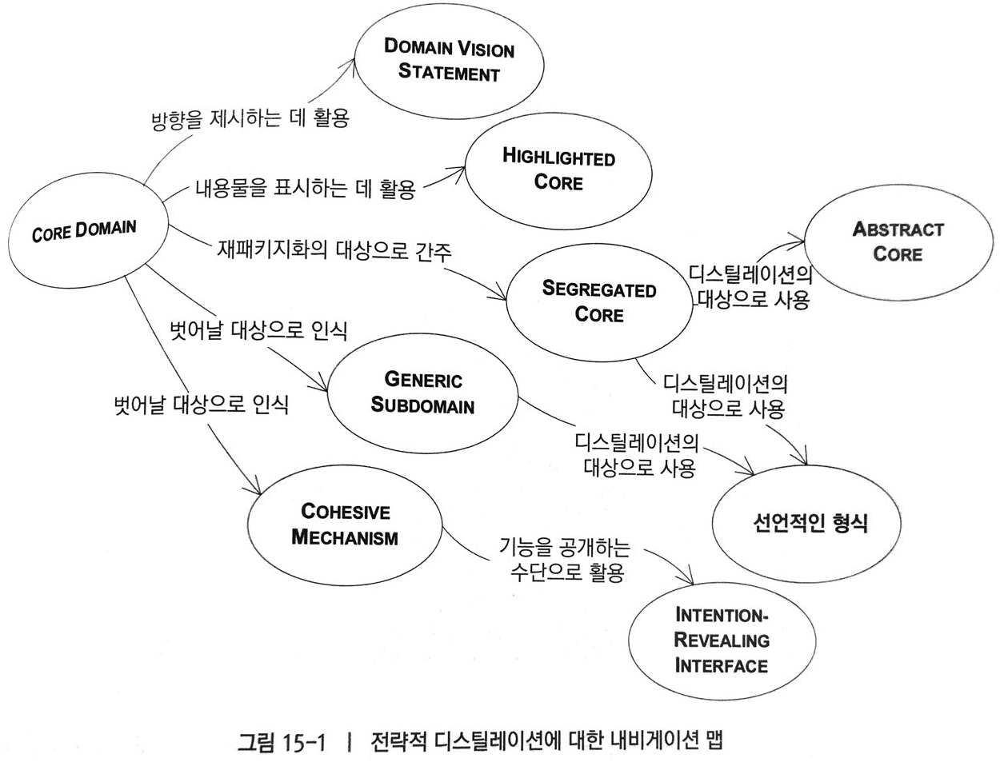
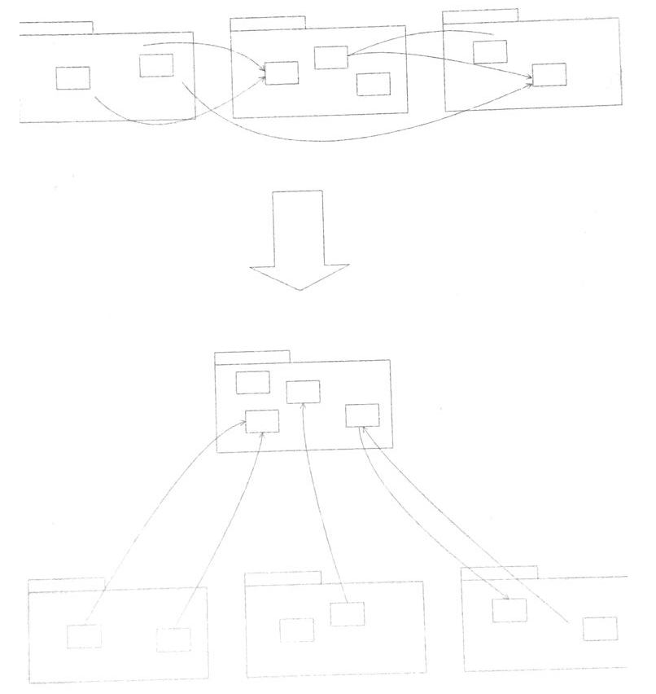

# 디스틸레이션
`디스틸레이션`은 **혼합된 요소**를 **분리**해서 **본질**을 좀더 값지고 유용한 형태로 뽑아내는 과정이다.

## CORE DOMAIN
규모가 큰 시스템을 설계할 때는 시스템에 기여하는 구성요소가 무수히 많은데, 모두 복잡하고 성공에 절대적이어서 진정한 업무 자산에 해당하는 도메인의 본질적인 측면이 가려지거나 방치될 수 있다. 

어떤 행위가 다른 곳에 이미 존재한다는 사실을 개발자가 알지 못하면 중복이 일어나고 시스템이 훨씬 복잡해진다. 현실은 설계의 모든 부분이 동일하게 정제되지 않고, 고급 기술을 가진 개발자가 기술적인 인프라스트럭처나 특별한 도메인 지식 없이도 다룰 수 있는 명료한 문제만 다루려고 한다는 것. 또한 보통은, 핵심부분은 숙련도가 낮은 개발자가 개발하더라.

> CORE DOMAIN을 찾아서 그것을 지원하는 여러 모델과 코드로부터 쉽게 구별할 수 있도록 하자. 가장 가치있고 전문화된 개념을 부각시키는 CORE를 아주 작게 만들자.
시스템의 비전을 수행하기 에 충분한 심층 모델을 찾고 유연한 설계를 할 수 있도록 CORE에 모든 노력을 쏟아라.

시간 제약 상 두가지 수행할 필요가 있는 리팩토링 가운데 어느 것을 결정해야 할 지 모를 때에는 CORE DOMAIN에 가장 큰 영향을 줄 수 있는 것을 먼저 선택해야한다.

### CORE의 선택
도메인에 대한 통찰력이 경험에 의해 깊어지면 일반화된 개념이 분리되고 오로지 모델의 특화된 측면만 CORE DOMAIN에 유지 되어 디스틸리에션 프로세스가 계속될 수 있다.
어떤 어플리케이션에서는 CORE DOMAIN인데, 다른 어플리케이션에서는 일반화된 보조 컴포넌트일 수도 있다.

### 누가 그 일을 할 것인가?
도메인 지식을 보조 컴포넌트처럼 인식하는 경향이 심화되며, 지식의 부족으로 프로젝트 구성원들이 도메인 지식을 축적할 기회를 얻지 못한다. 
> 오랜기간 팀에 참여하고 도메인 지식의 대장이 되는 데에 관심이 있는 개발자와 업무를 깊이 알고 있는 도메인 전문가로 팀을 구성.

### 디스틸레이션의 단계적 확대

1. 간단한 DOMAIN VISION STATEMENT(비전선언문)는 최소한의 투자로 기본 개념과 가치를 전달
2. HIGHLIGHTED CORE(강조된 핵심) 는 의사소통을 향상시키고 의사결정을 내리는 데 도움이 된다.(설계의 수정이 최소한이다.)
3. 좀더 적극적인 리팩터링과 재패키지화를 거쳐 명확하게 GENERIC SUBDOMAIN(일반화된 서브도메인) 을 구분하여 개별적으로 다룰 수 있다.
4. COHESIVE MECHANISM(응집된 메커니즘) 은 용도가 다양하고 의미전달이 용이, 유연한 설계를 통해 캡슐화 할수 있다.
5. SEGREGATED CORE(분리된 핵심) 를 재패키지화 하면 CORE를 코드상에서도 바로 볼수 있게 되고, CORE 모델에 대한 향후 업무가 쉬워진다.
6. ABSRACT CORE(추상화된 핵심) 는 가장 근본적인 개념과 관계를 순수한 형태로 표현(그리고 모델을 대상으로광범위한 재구성과 리팩터링이 필요)

## GENERIC SUBDOMAIN(일반 하위 도메인)
모델의 일부는 전문 지식을 포착하거나 전달하지 않고 복잡성을 더함. 부수적인 요소들이 CORE DOMAIN을 식별하고 이해하는 일을 방해. 
그럼에도 일반적인 그밖의 요소들은 시스템이 정상동작하고 모델을 완전히 표현하는데 중요한 역할을 한다.

> 현재 진행중인 프로젝트를 위한 것이 아니라 응집력 있는 하위 도메인을 식별하라. 이러한 하위 도메인에서 일반적인 모델 요소를 추출해서 별도 MODULE에 배치하라. 일단 분리되면, CORE DOMAIN 보다는 낮은 우선순위를 부여. 이런 GENERIC SUBDOMAIN은 기성 솔루션이나 공표된 모델을 고려해보라.

- 기성 솔루션 : 구현된 제품을 구입하거나 오픈소스를 이용
- 공표된 설계나 모델 : 코드화 되지 않은 설계나 모델을 이용
- 외주제작된 구현 : 외주로 제작하여 구현된 것을 이용
- 사내 구현 : 직접 구현

### 일반화가 재사용이 가능하다는 의미는 아니다
디스틸레이션의 기본적인 동기에서 본다면 코드의 재사용에 신경써서는 안된다. CORE DOMAIN에 가능한한 많은 노력을 기울이고 보조적인 성격의 GENERIC SUBDOMAIN에는 필요한 만큼만 투자하자.

> 재사용을 목표로 설계할 일은 거의 없더라도 일반 개념의 범위 내에서 설계를 유지하는 것과 관련해서는 엄격해야 한다.

### 프로젝트 위험 관리
애자일에서는 가장 위험스러운 업무를 먼저 다루는 식으로 위험을 관리한다.

> 팀원들이 검증된 기술을 보유하고 도메인에 매우 친숙한 경우를 제외하면 최초로 만들어진 시스템은 CORE DOMAIN의 특정 부분에 기반을 둬야하고 단순해아 한다.

## DOMAIN VISION STATEMENT(도메인 비전 선언문)
개발이 후반부에 이르면 모델을 심층적으로 연구하지 않아도 되는 시스템의 가치를 설명할 필요가 생긴다. 

> CORE DOMAIN을 짧게 기술하고 그것의 가치를 작성할 것. 이 도메인 모델과 다른 것을 구별하는데 도움되지 않은 측면은 무시하라. 도메인 모델이 어떻게 다양한 관심사를 충족하고 균형을 이루는지 볼것. 한정된 범위에서 유지할 것. 새로운 통찰력을 얻ㄷ을때 마다 선언문을 개정할 것

코드 자체의 디스틸레이션 과정에서 개발팀을 줄곧 공통적인 방향으로 향하게 할 이정표로 사용될 수 있다.(기술적인 부분이 제외된 문서이므로, 관리조직, 비기술팀원, 고객과도 공유 가능)

## HIGHTTED CORE(강조된 핵심)
코드에 구조적 변경을 가하는 것이 CORE DOMAIN을 식별하는 이상적인 방법이지만, 언제나 실용적인 것은 아니다. 팀에 그러한 구조적 변경을 향한 시각이 없다면 불가능.

MODULE이 모델의 이력을 전해줄수 있도록 적극적으로 GENERIC SUBDOMAIN을 분할 하는 것이 좋지만, 쉽지가 않다. 이러한 적극적 기법을 보완해줄 부담이 적은 해법이 있다

#### 디스틸레이션 문서
CORE DOMAIN을 기술하는 문서인데 가장 본질적인 개념적 객체 만큼 간결하게 만든다. 완벽한 설계문서는 아닌데 CORE DOMAIN와 CORE의 구성요소 사이에 일어나는 상호작용을 기술하는 매우 간결한 문서이다. 
그러나 문서를 별도로 관리했을때는 아래와 같은 문제가 발생

1. 문서가 관리되지 않는다.
2. 문서를 아무도 읽지 않는다.
3. 정보의 출처가 늘어남으로써 복잡성을 관통하는 문서의 본연의 목적이 무의미해진다.

해결책 
> 절대적으로 최소주의를 지향, 비기술 관련 팀우언도 이해할 수 있도록 작성

JavaDoc의 형태로 작성해도 좋다. 모델의 주요 저장소안에 있는 CORE DOMAIN의 구성 요소에 대해 그것의 역할을 설명하려 하지말고 표시하고, 개발자가 그것의 안과 밖을 구별할 수 있도록 하라. 

디스틸레이션 문서가 CORE DOMAIN의 본질적인 면면의 윤곽을 드러내기에 모델의 변경이 일어나면 팀원에게 알리고 문서에 반영하여야 한다. 

VISION STATEMENT 와 HIGHLIGHTED CORE는 정보를 제공하고 안내할 뿐, 실제로 모델이나 코드자체를 수정하지는 않는다.

## COHESIVE MECHANISM(응집력 있는 메커니즘)
때때로 계산하는 코드는 설계를 부풀리기 시작하는 수준의 복잡성에 이르기도한다. 개념적인 `무엇` 이 기계적인 `어떻게` 탓에 수렁에 빠진다. 문제를 해결하는 알고리즘을 제공하는 수많은 메서드가 문제를 표현하는 메서드를 불분명하게 만든다.

> 개념적으로 COHESIVE MECHANISM을 별도의 경량 프레임워크로 분리하라. INTENTION-REVEALING INTERFACE로 프레임워크의 기능을 노출하고, 도메인의 다른 요소들은 해법의 복잡성 `어떻게`을 프레임워크에 위임하여 문제`무엇`을 표현하는데 집중할 수 있다.

COHESIVE MECHANISM의 예 : SPECIFICATION 객체를 구성하고 기본적인 비교 및 조합연산을 지원하는 프레임워크

#### GENERIC SUBDOMAIN과 COHESIVE MECHANISM
둘다 CORE DOMAIN의 부담을 덜어주는 역할이지만 
- GENERIC SUBDOMAIN : 도메인을 어떻게 바라보는지와 관련된 일부 측면만을 나타내는 표현력있는 모델에 토대를 둔다.
- COHESICE MECHANISM : 표현력 있는 모델에서 제기하는 일부 성가신 계산 문제를 해결해 줄 뿐이다.

#### MECHANISM이 CORE DOMAIN의 일부인 경우
 CORE DOMAIN으로부터 MECHANISM을 제고 하고 싶지만 그 자체가 기업의 소유이고 소프트웨어 가치의 핵심 부분을 차지하는 경우, 간혹 CORE의 일부로 여겨질 수도 있다. 이러한 경우 MECHANISM을 조더 명확하게 구분짓는 심층적인 모델이 필요하다. 

## SEGREGATED CORE(분리된 핵심)
모델의 요소들은 부분적으로는 CORE DOMAIN이 역할을 수행, 혹은 부분적으로는 SUBDOMAIN의 역할을 수행. CORE의 개념적 응집성은 뚜렷이 나타나지 않거나 드러나지 않을지도 모른다. 이러한 모든 혼란과 얽힘은 CORE를 질식 시킨다.

> 보조적인 역할로부터 CORE의 개념을 분리되게끔 모델을 리팩터링하고 다른코드와의 결합은 줄이며 응집력을 강화하라. 일반적이거나 보조적인 역할을 하는 구성요소를 다른 객체로 추출해서 다른 패키지에 배치하라.

배치하는 방법
1. CORE 하위 도메인을 식별한다. 
2. 새로운 MODULE 관련 클래스를 옮긴다.
3. 개념을 직접적으로 표현하지 않는 서버데이터와 기능으로 코드를 리팩터링.
4. CORE 하위 도메인의 불순물을 제거하고 그곳에서 다른 패키지를 참조하는 바를 명시적이고 그 자체로 이해할 수 있는 상태로 만든다.
5. 새로생긴 SEGREGATED CORE MODULE 의 관계와 상호작용을 단순하고 전달력있게 만들고, 다른 MODULE과의 관계가 최소한으로 하도록 리팩터링한다.
6. 위의 과정을 SEGREGATED CORE가 완벽해질때까지 반복한다.

## ABSTRACT CORE(추상화된 핵심)

별도 MODULE의 하위 도메인 간에 상호작용이 활발한 경우 MODULE간에 참조가 많이 만들어져야 해서 분할의 가치가 상당수 사라지거나, 또는 상호작용이 간접적으로 일어나야해서 모델이 불분명해질 것이다.

> 모델의 가장 근본적인 개념을 식별해서 그것을 별도의 클래스나 추상클래스, 또는 인터페이스로 분리하라. 그리고 이 추상 모델이 중요 컴포넌트간에 발생하는 상호작용을 대부분 표현할 수 있게끔 설계하라. 

ABSTRACT CORE를 뽑아내는 과정은 기계적으로 수행하는 것이 아니다. 여러 MODULE간에 빈번하게 참조되는 클래스를 모두 자동으로 별도의 MODULE로 옮겼으면 의미없다.
핵심 개념과 해당 개념이 시스템의 주요 상호작용에서 수행하는 역할을 심층적으로 이해해야한다.

1. 고통 주도적 리팩토링에서는 문제의 근원에 CORE DOMAIN이나 CORE와 지원 요소와의 관계가 있는지 살피고, 만약 그렇다면 **이를 악물고** 그 부분을 가장 먼저 고쳐야한다.
2. 마음껏 리팩토링 할 수 있는 상황이라면 제일 먼저 CORE DOMAIN을 잘 분해하고 격리하여 보조적인 하위 도메인이 GENERIC하게 만드는 데 집중하자.

