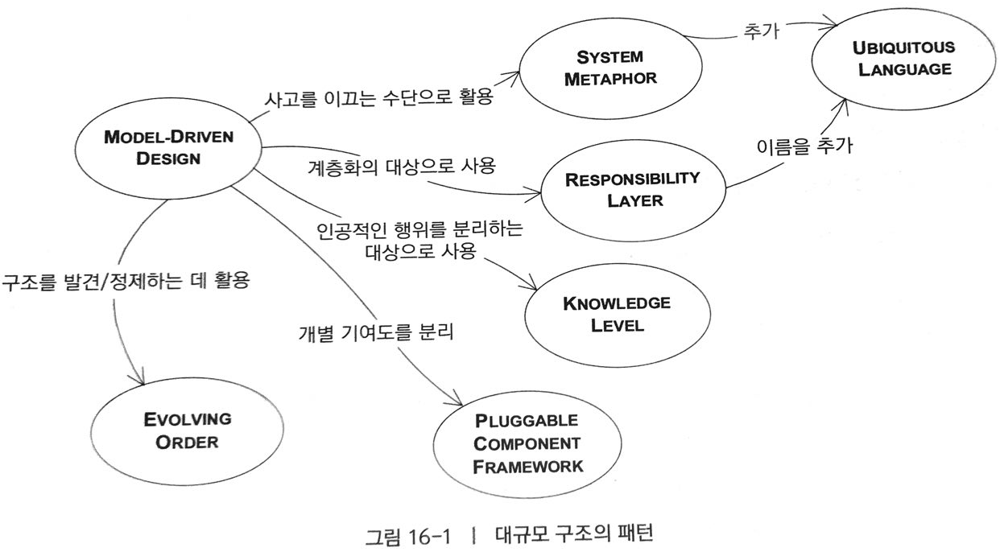
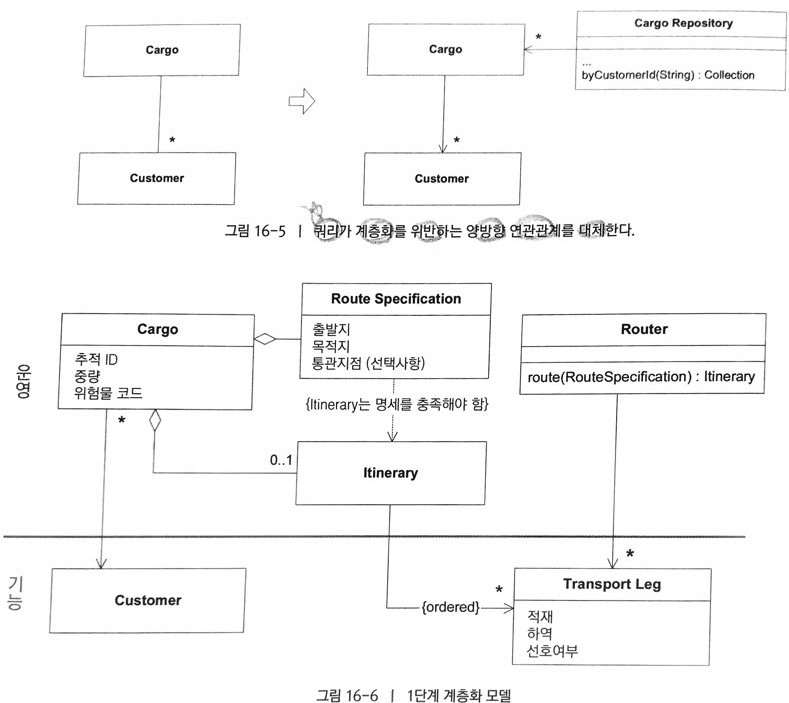
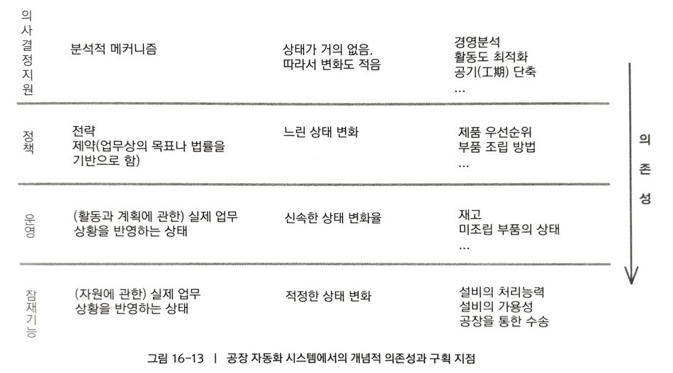
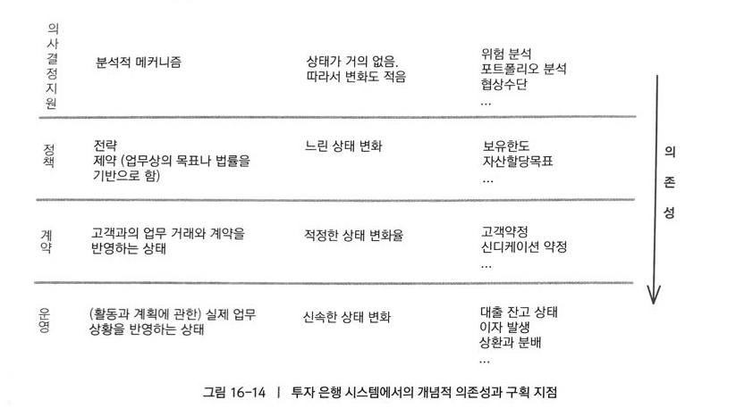

# 대규모 구조

큰 시스템에 해당 시스템의 요소를 전체 설계에 걸친 패턴에서의 역할 측면에서 해석하게 할 수 있는 **지배적인 원칙**이 없다면 개발자들은 **나무만 보고 숲**을 보지 못한다. 우리는 전체 세부사항을 깊이 파고들지 않고도 전체의 각 부분이 담당하는 역할을 이해할 수 있어야 한다. `대규모 구조`는 넓은 시각으로 시스템에 관해 토의 하고 이해하게끔 돕는 언어다. 고수준 개념이나 규칙, 또는 둘 모두는 전체 시스템에 대한 설계 패턴을 확립한다.

> 전체 시스템을 포괄하고 각 부분의 책임을 자세히 알지 못해도 전체적인 관점에서 해당 부분의 우치를 어느정도 이해하는데 도움을 주는 규칙 또는 규칙과 관계의 패턴을 고안하라.

## EVOLVING ORDER(발전하는 질서)

아무나 설계 할 수 있다면 누구도 이해할수 없고 유지보수 하기 힘든 시스템이 만들어진다. 개발자들이 구조를 맞추려고 애플리케이션의 수준을 떨어뜨리거나 뒤엎는 방식으로 구조도 없게 만드는 문제가 다시 초래한다.

> 개념적인 대규모 구조가 애플리케이션과 함께 발전해서 도중에 전혀 다른 형식으로도 변화할 수 있도록 만들어라. 세부적인 설계와 모델에 관련된 의사결정을 과도하게 제약해서는 안된다.

CONTEXT MAP과 달리 대규모 구조는 선택사항이다. MODULE 분리로 충분히 이해할 수 있을정도로 간단한 시스템이라면 대규모 구조가 필요하지 않다.

적을 수록 많은 법이다.

## SYSTEM METAPHOR(시스템 은유)

소프트웨어 설계는 매우 **추상적**이고 파악하기 힘든 경향이 있다. **개발자와 사용자** 모두 시스템을 이해하고 **시스템을 전체적**으로 바라보는 시각을 공유할 **구체적인 수단**이 필요하다.
`SYSTEM METAPHOR`는 객체 패러다임과 조화를 이루는, 느슨하고 쉽게 이해할 수 있는 **대규모 구조**다. 하지만 어쨋든 도메인에 대한 일종의 비유에 불과하므로 다양한 모델이 적절한 방법으로 SYSTEM METAPHOR에 매핑될 수 있다.

> 어떤 시스템의 구체적인 비유가 나타나 팀원의 상상력을 포착하고 유용한 방향으로 이끈다면 그것을 대규모 구조로 채택하라. 이러한 은유를 중심으로 설계를 구성하고 UBIQUITOUS LANGUAGE로 흡수하면, SYSTEM METAPHOR는 의사소통을 촉진하고 해당 시스템의 개발로 이끈다. 그러나 모든 은유는 부정확하므로 지속적으로 점검하고 방해가 된다면 버리자.

## RESPONSIBILITY LAYER(책임 계층)
각 개별 객체에 책임이 따로 할당 되어 있다면, 가이드라인도 없고 균일함과 넓은 범위에 걸친 도메인을 동시에 다룰 능력도 없는 것이다. 큰 모델에 응집력을 부여하려면 그러한 책임 할당에 특정 구조를 도입하는 것이 도움이 된다.

자연적인 구조의 이점을 취해 더 눈에 잘띄고 유용하게 만드는 방법은 `계층화`

RESPONSIBILITY LAYER와 가장 부합하는 계층화패턴은 RELAXED LAYERED SYSTEM 이라고 하는 계층화의 일종인데, 이것은 **한 계층의 구성요소**가 바로 **아래**에 있는 것만이 아니라 **모든 하위 계층에 접근**하는 것을 허용한다.

> 도메인에서 **자연적인 층**을 식별하면 그것을 **광범위한 추상적 책임**으로 간주하라. 이러한 책임은 시스템의 높은 수준에서 목적과 설계에 대한 느낌을 줄 것이다. AGGREGATE, MODULE과 같은 각 도메인 객체의 책임이 한 계층의 책임 안에 맞도록 리팩터링 하라.

### 예제 : 해운 시스템의 계층화

- 운영 책임
	\- 과거, 현재, 미래의 회사 활동은 운영계층에 모임, 가장 눈에 띄는 객체는 Cargo
- 기능 책임
	\- 이 계층은 운영활동을 수행하고자 회사에서 사용하는 자원을 반영, Transit leg(수송 구간)이 전형적인 예

> Cargo 와 Customer 사이의 연관관계는 한 방향으로만 탐색 할 수 있으므로 Cargo Repository에는 특정 Customer의 Cargo를 모두 찾는 쿼리가 필요할 것이다.

- 의사결정 지원 책임
	\- 사용자에게 계획과 의사 결정을 위한 도구를 제공하고, 잠재적으로 특정 의사결정(운송일정이 바뀌면 자동으로 Cargo의 운송 항로를 재 설정하는..)을 자동화할 수도 있다.
	\- Router는 예약 에이전트가 Cargo를 보내는 **최선의 방법**을 고르는데 **도움**을 주는 SERVICE다. 이런 이유로 **Router**는 정확히 **의사결정 지원 책임**에 속한다.

### 적절한 계층의 선택

계층이 바뀌고 병합되고 나뉘고 재정의될 때 지켜야할 특징

1. 스토리 텔링 : 계층은 도메인으 기본적인 실제 상황과 우선순위를 전해줘야한다.
2. 개념적 의존성 : `상위` 계층에 있는 개념은 `하위` 계층을 배경으로 하는 의미를 지녀야 하고, 동시에 하위계층의 개념은 독자적인 의미를 지녀야 한다.
3. CONCEPTUAL CONTOUR : 다양한 계층에 놓인 객체가 변화의 근원이 다르다면 구역을 나누는 일에 일조한다.

> **계층화 시스템**을 단순하게 유지하는 것이 가장 좋고 대규모 시스템은 철저하게 정제되어야 한다. 위의 다섯가지 계층은 다양한 기업 시스템에 적용할 수 있지만 모든 도메인의 가장 중요한 책임을 포착하지는 못한다. 궁극적으로 자신의 직관을 바탕으로 **질서가 발전**ORDER EVOLVE하도록 해야 한다.

## KNOWLEDGE LEVEL(지식 수준)
KNOWLEDGE LEVEL은 더 넓은 규칙으로 제약되기 전까지 모델의 특정 부분을 사용자의 손에 맡겨야 할때 생기는 문제를 해결.

ENTITY간의 역할과 관계가 각 상황마다 다양하게 작용하는 애플리케이션에서는 복잡성이 폭발적으로 증가할 수 있다. 완전히 일반화 혹은 고도화가 가능한 모델도 사용자의 욕구를 충족시키지 못하는데, 결국 객체는 다양한 경우를 다루기 위해 다른 타입을 참조하거나 각종상황에서 여러가지 방법으로 사용될 속성을 갖게 된다. 

KNOWLEDGE LEVEL 은 REFLECTION 패턴의 도메인 계층을 응용한 것.
REFLECTION 패턴은 소프트웨어를 자각적(self-aware)로 만들고 소프트웨어의 구조와 행위에서 선택한 측면이 적응과 변화를 쉽게 할 수 있도록 만든다.
이것은 소프트웨어를 운영적 책임을 수반하는 `기반수준(base level)`과 소프트웨어의 구조와 행위에 대한 지식을 나타내는 `메타수준(meta level)`으로 분리함으로써 달성된다.

하지만 언어에서 제공하는 reflection 도구는 도메인 모델의 KNOWLEDGE LEVEL을 구현하는데 사용하는 것이 아니다.

> 기본적인 모델의 구조와 행위를 서술하고 제약하는데 사용할 수 있는 별도의 객체 집합을 만들어라. 이런 관심사를 두가지 수준으로 분리, 하나는 매우 구체적으로 만들고, 다른 하나는 사용자가 관리자의 맞춤화가 가능한 규칙과 지식을 반영하게 만들어라.

KNOWLEDGE LEVEL이 복잡해지면 개발자들도 시스템의 행위를 이해하기 힘들어짐.

KNOWLEDGE LEVEL이 RESPONSIBILITY LAYER의 특수한 경우처럼 보이기도 하지만, 의존성의 방향이 다르다. 
- RESPONSIBILITY LAYER에서는 하위 계층이 상위 계층에 독립적이고
- KNOWLEDGE LEVEL은 양방향으로 작용한다.

## PLUGGABLE COMPONENT FRAMEWORK(탈착식 컴포넌트 프레임워크)
`PUGGABLE COMPONENT FRAMEWORK` 는 대게 동일한 도메인에서 일부 어플리케이션이 구현되고 난 후에야 나타나기 시작한다. 
 모두 같은 추상화에 기반을 두지만 서로 독립적으로 설계되어 있는 다양한 종류의 애플리케이션이 상호운용되어야 할때 BOUNDED CONTEXT 사이의 번역 때문에 통합이 제한된다. SHARED KERNEL은 서로 긴밀하게 일하지 않는 팀에는 맞지 않다.

 > 인터페이스와 상호작용에 대한 ABSTRACT CORE를 정제하고 그러한 인터페이스의 다양한 규현이 자유롭게 대체될 수 있는 프레임워크를 만들어라. ABSTRACT CORE를 통해 모든 컴포넌트가 정확히 작동하도록 하라.

### 구조는 얼마나 제약성을 지녀야 하는가?

 운영 계층은 반드시 있는 그대로의 현실을 반영해야 한다. 예외가 발생하면 상위 계층에 전달되어야 한다. 운영계층에서는 상위계층에 관해 아무것도 알지 못한다. 운영 객체는 상태가 변경될 때마다 이벤트를 발생시킨다. 정책 계층 객체는 하위 계층으로부터 전달된 중요 이벤트를 기다린다. 

 구조가 맞아 떨어지면 규칙은 개발자가 훌륭한 설계로 나아가게 할 것이다. 각 구조적 규칙은 개발을 용이하게 한다.

### 잘 맞아떨어지는 구조를 향한 리팩토링
EVOLVING ORDER에 전념하는 팀은 생명주기 내내 대규모구조를 과감히 [재고](https://ko.dict.naver.com/detail.nhn?docid=32429101)해야 한다. 비용을 통제하고 이익을 극대화하는 방법

#### 최소주의
초반에는 SYSTEM METAPHOR나 몇 가지 RESPONSIBILITY LAYER와 같은 느슨한 구조를 선택하면, 혼돈을 방지하는데 도움이 된다.

#### 의사소통과 자기훈련
팀 전체는 새로운 개발과 리팩토링을 할 때 반드시 구조를 따라야한다. 팀은 반드시 자기 훈련(self-discipline)을 수행해야 한다. 많은 사람들이 일관되게 따르지 않으면 구조는 **쇠퇴** 한다.

#### 재구조화가 유연한 설계를 낳는다.
구조는 시스템의 복잡성이 증가하고 이해가 깊어질 수록 발전한다. 구조가 바뀔때마다 전체시스템은 새로운 질서를 따르도록 바뀌어야한다. 반복하다보면 안정적인 측면은 단순화 되고, 늘어나는 지식이 모델에 녹아들어 변화의 중심축이 식별되어 유연해진다. 근간이 되는 전반적인 CONCEPTUAL CONTOUR가 모델의 구조에 나타남.

#### 디스틸레이션은 부하를 줄인다
