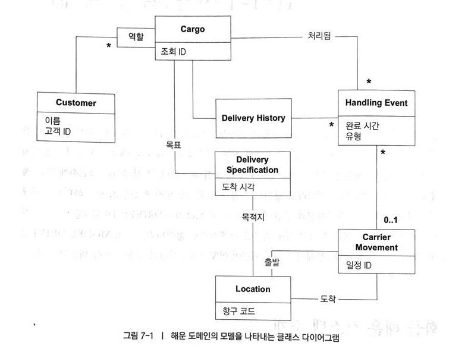
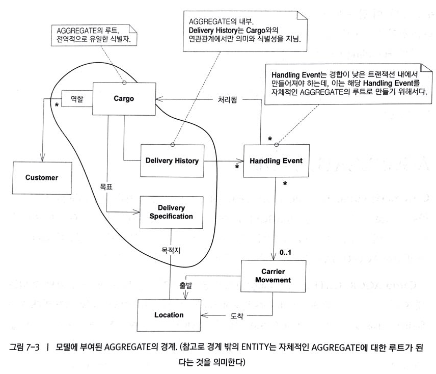
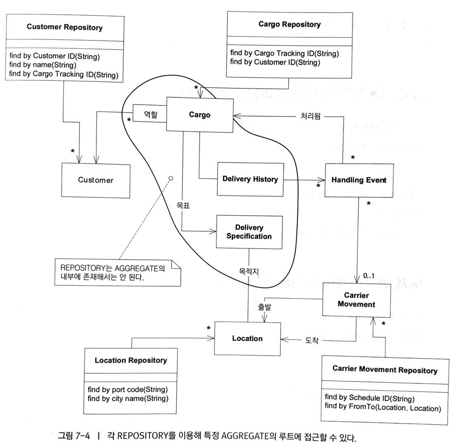
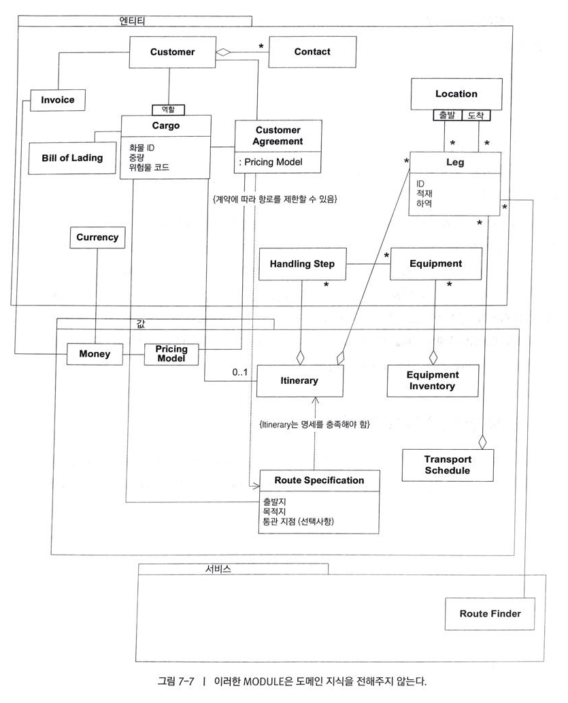
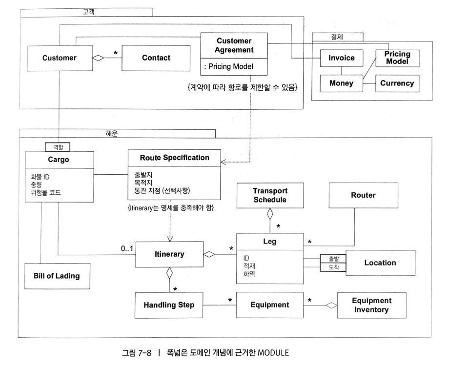

# 언어의 사용(확장 예제)

### 화물 해운 시스템 소개

요구사항 

1. 고객 화물의 주요 처리상황 추적
2. 화물 사전 예약
3. 화물이 일정한 지점에 도착할때 자동으로 고객에게 송장 발송



### ENTITY와 VALUE OBJECT의 구분

- Customer : Customer객체는 그것을 사용하는 사람에게 중요한 **식별성**을 지니고 있으므로 **모델내에서 ENTITY**에 해당한다.
- Cargo : 두 개의 동일한 컨테이너를 서로 **구분**할 수 있어야 하므로 **ENTITY**다. 실제로 모든 해운회사에서는 각 화물에 조회 ID를 할당한다.
- Handling event와 Carrier movement : 개별 사건은 현실세계의 사건을 반영하며, 대개 서로 교환할 수 없으므로 **ENTITY**에 해당한다. 각 Carrier Movement는 해운 일정에서 획득한 코드로 식별될 것이다. (도메인 전문가와 한번더 논의를 거쳐 CargoID와 완료시간, 화물 요형을 조합하면 Handling Event의 복합키로 식별할 수 있다는 사실을 알게 되었다.)
- Location : 정확한 경도와 위도를 유일한 키로 사용할 수는 있겠지만 현재 시스템의 목적에는 맞지 않는다. Location은 해운 항로를 비롯한 기타 도메인에 특화된 관심사에 따라 장소를 지정하는 지리학적 모델의 일부가 될 것이다. 이 경우에는 자동으로 생성되는 random하고 내부적인 **식별자**로 충분하다.
- Delivery History : 서로 **대체할 수 없으**므로 **ENTITY**에 해당한다. 다만, ID는 그것을 소유한 Cargo에게서 가져온 것이다.이는 AGGREGATE를 모델링할 때 분명해진다.
- Delivery Specification : Cargo의 목표를 나타내지만 Cargo에 dependent 하지는 않다. 실제로 DeliverySpecification은  DeliveryHistory의 **가상적인 상태**를 나타낸다. Cargo의 DeliveryHistory가 결국은 DeliverySpecification을 충족한다.(배송지에 도착 했을 때, 두 데이터는 같다.) 
만약, 두 개의 Cargo 배송지가 동일하다면 DeliverySpecification을 공유할 수는 있지만, DeliveryHistory는 공유할 수 없을 것이다. 그러므로 **VALUE OBJECT** 이다.
- 그밖의 **날짜나 시간 이름**과 같은 속성은 **VALUE OBJECT** 이다.

## 해운 도메인의 연관관계 설계

규모가 큰 시스템에서 Customer는 여러 객체를 다루는 역할만 맡게 하여 특화된 책임에서 벗어나게 하자.(쿼리로 조회할 수도 있다. )

## AGGREGATE의 경계

> Customer와 Location, Carrier Movement는 자체적인 식별성을 지니고 여러 Cargo에서 공유되므로 자체적은 Aggregate의 루트.
> 특정 Cargo가 존재하지 않으면, Delivery History, Delivery Specification, Handling Exception 모두 존재하지 않으므로 Cargo Aggregate는 이것들을 모두 포함.



## REPOSITORY의 선정
AGGREGATE 의 루트인 ENTITY가 5개 존재한다.

1. Customer Repository : 예약을 수행하려면 다양한 역할을 수행하는 Customer가 필요하므로 
2. Location Repository : Cargo의 목적지를 지정해야 하므로 
3. Carrier Movement Repository : 활동기록을 위해 현재 Cargo가 적재 되어 있는 Carrier Movement를 찾기 위해
4. Cargo Repository : Cargo가 적재 되었는지 시스템에 알려주기 위해

> 현재 Delivery Event Repository가 존재하지 않는데, 이것은 **Delivery History와의 연관 관계를 컬렉션으로 구현하기(iteration 1)**로 했고, 요구사항에 **Carrier Movement**에 적재된 것을 찾아야한다는 내용이 없었다.(하지만 **전제**가 바뀌면 그 때 **Repo를 추가**해도 된다!!!)



## 객체 생성
생성자를 이용해서 자신의 불변식을 이행하거나, ENTITY의 경우 자신의 식별성을 갖는 객체를 생성하기 위해, Cargo Factory 메서드를 만들지 모른다.

```java

public Cargo copyPrototype(String newTrackingId);

```

아니면 독립형 Factory에 메서드를 만들수도 있다.

```java

public Cargo newCargo(Cargo prototype, String newTrackingId);

```
독립형 Factory는 새 Cargo의 ID를 획득하는 과정을 캡슐화 하여 인자가 하나만 필요한 메소드를 작성할 수 있다.
```java

public Cargo newCargo(Cargo prototype);

```
보통 이런 FACTORY에서 반환되는 결과는 모두 비슷하다.(빈 Delivery History와 null값으로 설정된 Specification이 포함된 Cargo 일 것이다.)
그리고 Cargo와 DeliveryHistory는 양방향 관계로 반드시 함께 생성되지만, Cargo는 Delivery History를 포함하는 Aggregate의 루트이므로 아래와 같이 생성자가 만들어진다.
```java

public Cargo(String id) {
	trackinId = id;
	deliveryHistory = new DeliveryHistory(this);
	customerRoles = new HashMap();
}

```
Delivery History의 생성자는 자신의 Aggrecate의 루트인 Cargo에 의해 배타적으로 사용됨으로 캡슐화 된다.

### Handling Event 추가
현실 세계에서는 화물이 처리 될 때마다 Incident Logging Application(사건 기록 어플리케이션)을 이용해 Handling Event를 기록한다. 모든 Entity는 생성자가 필요하고 Handling Event는 화물 ID, 완료시간, 이벤트의 종류를 조합한것으로 복합키를 사용할 수 있다. 생성자는 아래 ..
```java

public HandlingEvent(Cargo c, String eventType, Date timeStampl);

```
보통은 미처확인하지 못한 Entity의 속성(이벤트 타입에 대한 FactoryMethod를 추가하면 클라이언트가 더욱 표현력 있을것 같다)은 나중에 추가할 수 있다. 
```java

public static HandlingEvent(Cargo c, String eventType, Date timeStampl) {
	HandlingEvent result = new HandlingEvent(c, eventType, timeStampl);
	result.setCarrierMovement(loadedOnto);
	return result;
}

```

### Cargo Aggregate의 설계 대안

- Delivery History에 대한 Handling Event 컬렉션을 쿼리로 교체하면, Handling Event는 자체적인 Aggregate 외부에 아무런 무결성 문제를 일으키지 않고도 추가될 수 있다.
- 쿼리에 대한 책임을 담당하고자 여기서는 Handling Event에 대한 Repository를 추가한다. 

> 위와 같이 할 경우 CargoFactory는 더욱 단순해져서 새로운 인스턴스에 비어있는 DeliveryHistory가 붙지 않는다.
> 이처럼 Value와 Entity, 그리고 그것들의 Aggregate를 모델링해서 설계변경에 따른 파급효과를 줄였다.


## 해운 모델의 Module



> 위와 같은 Module은 좋지 않은 방식....



> 상대적으로 조금 더 나은 Module 구성


### 새로운 기능 도입(할당량 검사)
다른 시스템과의 연계는 **Model-Driven-Design** 을 지속해 나가기 어렵게 하고 **UBIQUITOUS LANGUAGE**에 혼란을 가중시킨다.

대신 모델과 타 시스템에서 쓰는 언어를 서로 번역<sup>translate</sup>하는 다른 클래스를 만든다.(필요한 기능만 노출하며, 도메인 모델 관점에서 기능은 재추상화 된다. 이 클래스는 **ANTICORRUPTION LAYER**의 역할을 수행) 시스템에서 맡은 책임을 반영하는 "Allocation Checker"라는 Service를 이용해 구현한다.(이름을 외부 시스템의 interface라고 할 수도 있지만, 그렇게 하면 **모델을 재분석할 기회**를 잃는다.)
"Allocation Checker" 와 같은 Service는 **외부 시스템**에 성능문제와 같은 이슈가 발생할 때, 그 문제를 **해결할 기회**를 제시하기도 한다.

## 최종 검토
이러한 통합으로 처음의 설계가 얽히고 설켜서 지저분해질 수도 있지만, 지금은 **Anticorruption Layer**와 **Service**, 그리고 몇가지 **Enterprise Segment**를 이용해 도메인을 풍부하게 하면서도 외부 시스템의 기능을 예약 시스템에 통합했다. 

Enterprise Segment를 도출하는 책임을 왜 Cargo에 하지 않았나?

> 사실 그런 데이터를 Cargo의 유도속성<sup>derived attribute</sup>으로 만드는 것이 우아해보일수 있지만, 이후에 Cargo가 전혀 다른 시스템에 따라 재구성 되어야 할 경우에, Cargo는 **여러 시스템을 알아야하는 책임**을 지게 된다.
> 따라서 각 규칙은 Strategy로 나누어 구현하는 것이 맞다.
