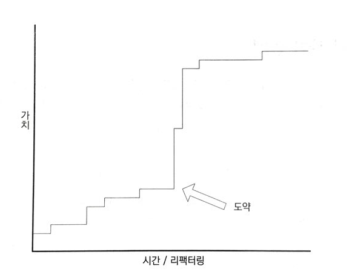

# 도약

> 리팩토링의 효과는 선형적으로 증가하지 않는다. 리팩토링은 [엔트로피](https://m.blog.naver.com/insightbook/100016489198) 와의 싸움이며 레거시 시트템이 퇴보하는 것을 막는 최전선에 놓여있다. 하지만 통찰력은 어느 순간 갑자기 떠오르고 그에 따른 충격여기서 말하는 도약은 프로젝트 전체로 퍼져 나간다.

## 도약에 관한 일화
Syndicated Loans연합은행 대출을 예로 설명하는데, 1차적으로 Loan의 지분과 Facility의 지분을 나누는 리팩토링을 진행하며 도약하였고, 2차적으로 SharePie지분총액라는 개념으로 도약하였다.

> 이러한 모델의 성숙으로 인해 다이어그램이 "너무 기술적"이라고 지적 하곤 했던 도메인전문가들은 새로운 모델 다이어그램을 완벽하게 이해할 수 있게 되었다. 모델의 성숙은 엄청나게 힘든 작업이다.저자는 프로젝트 이후에 앓아누었다고 표현.

### 냉정한 결정
리팩토링의 근본적인 취지는 항상 모든 것이 정상적으로 동작하는 상태를 유지하면서 작은 단계를 밟아가며 코드를 개선한다는 점이다.
정치적인 상황이 불안정해서 리팩토링을 해야한다고 결정하면, 외부에서 들어오는 다양한 압박에 대항해야 한다. 하지만 **장기적**으로 봤을 때 **지금 리팩토링을 하는 것이 위험을 완화**시키는 길이다.

## 기회
심층모델로 도약할 수 있는 기회가 찾아올 때 우리는 종종 두려움을 느낀다. 그러한 변화는 대부분의 리팩토링에 수반되는 것보다 더 큰 기회와 더 큰 위험을 수반한다. 진정으로 **심층모델**로 나아가려면 **근본적인 사고 방식의 전환**이 필요하며 설계의 대부분을 수정해야 한다.

## 기본에 집중하라. 
보통 수많은 리팩토링을 수행하고 나서야 **도약**이 나타난다. **도약**이 등장할 수 있는 무대를 만드려면, **지식탐구**와 함께 인내심을 가지고 **UBIQUITOUS LANGUAGE**를 만드는 일에 집중 해야한다.