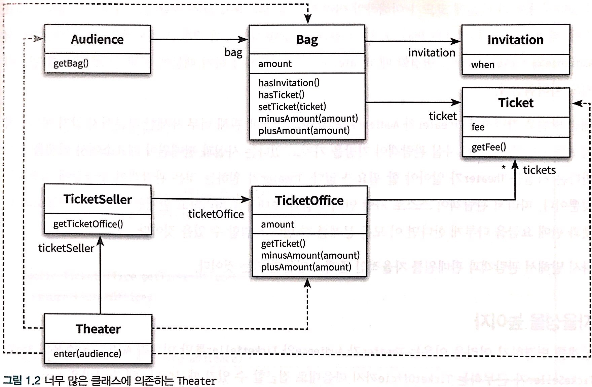
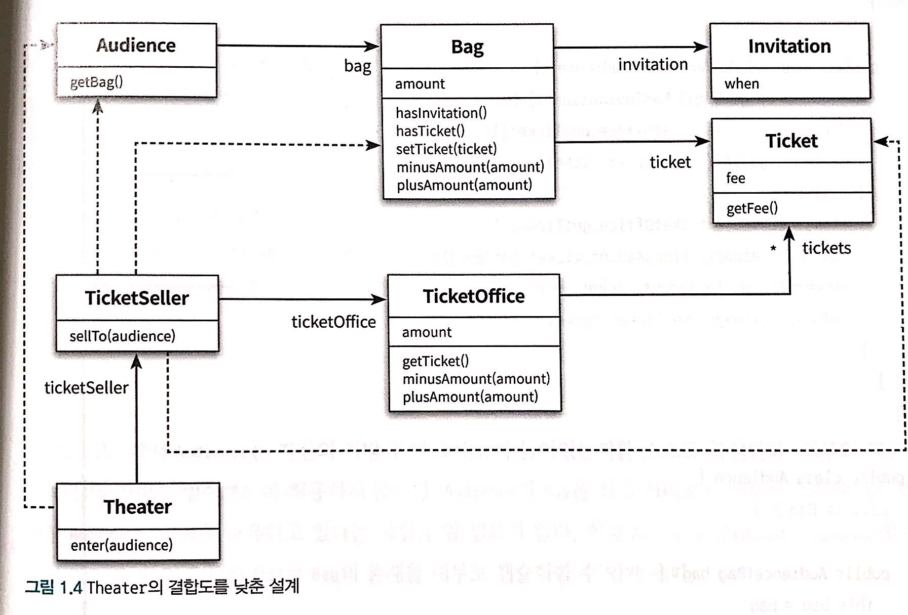
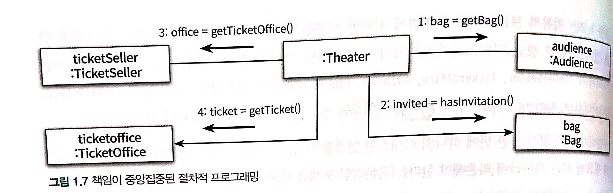
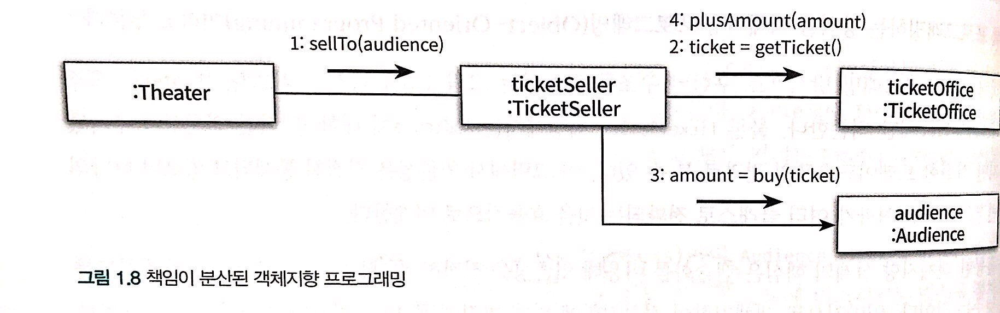

# 1. 객체, 설계
- 이론보다 실무가 먼저다. 
로버트 L. 글래스

## 티켓 판매 애플리케이션 구현하기
- 

## 무엇이 문제인가?
- 잘 돌아가긴 하지만, 문제가 많다.
- 현실과 다르게관람객과 판매원이 소극장의 통제를 받는 수동적인 존재가 되어있다.
- 소극장이 고객의 허락없이 가방 안의 돈을 직접 가져간다.
- 코드를 이해하기 위해 여러가지 세부사항을 기억해야 함.
- 변경에 너무나도 취약하다.

### 자율성을 높이자 
- 관람객과 판매원을 자율적인 존재로 만들자.
- 개념적이나 물리적으로 객체 내부의 세부적인 사항을 감추자캡슐화
- Theater 는 오직 TheaterSeller의 인터페이스에만 의존. TicketSeller 가 내부에 TicketOffice 인스턴스를 포함하고 있다는 사실은 구현의 영역에 속함.

### 무엇이 개선되었는가?
- Audience나 TicketSeller 의 내부 구현을 변경하더라도 Theater를 변경할 필요가 없어짐.

### 어떻게 했는가?
- 자기 자신의 문제를 스스로 해결하도록 코드를 변경.
- 수정 후의 Theater는 Audience나 TicketSeller 내부에 직접 접근하지 않음. 

### 캡슐화와 응집도
- 자신에게 밀접하게 연관된 작업만을 수행하고 연관성 없는 작업은 다른객체에게 위임하는 객체를 응집도가 높다고 말한다.
- 객체의 응집도를 높이기 위해서 객체 스스로 자신의 데이터를 책임져야 함.

### 절차지향과 객체지향
- 프로세스와 데이터를 별도의 모듈에 위치시키는 방식이 **절차 지향적 프로그래밍**
- 어떠한 객체라도 변경될 경우 Theater도 변경 되어야 함.
- 데이터와 프로세스가 동일한 모듈 내부에 위치하도록 하는 방식을 **객체지향 프로그래밍** 이라고 함.
- 캡슐화를 이용해 의존성을 적절히 관리

### 책임의 이동
- 현재 잘못된 것은 모든 책임이 Theater에 집중되어 있다는 것.
- 핵심은 적절한 객체에 적절한 책임을 할당하는 것임.

- 설계를 어렵게 만드는 것은 의존성. 불필요한 의존성을 제거하여 객체 사이의 결합도를 낮출 것.

### 더 개선할 수 있다. 
- 사실 높은 결합도는 변경하기 어렵지만, 객체의 자율성을 높힐수도 있음. 이 모든 것이 트레이드 오프이다.

### 그래, 거짓말이다.
- 객체는 현실에서는 수동적일지라도 객체지향의 세계에서는 능동적으로 변한다.

## 객체지향 설계
### 설계가 왜 필요한가?
- 설계를 구현과 떨어트려서 얘기하는 것은 불가능.
- 기능을 구현하는 코드를 짜야 하는 동시에 내일 쉽게 변경할 수 있는 코드를 짜야함.
- 우리가 진정으로 원하는 것은 변경에 유연하게 대처하는 코드.

