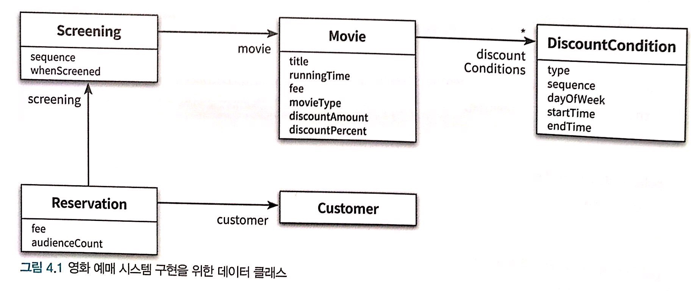
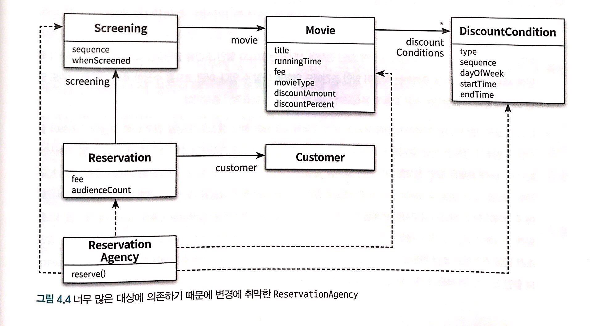
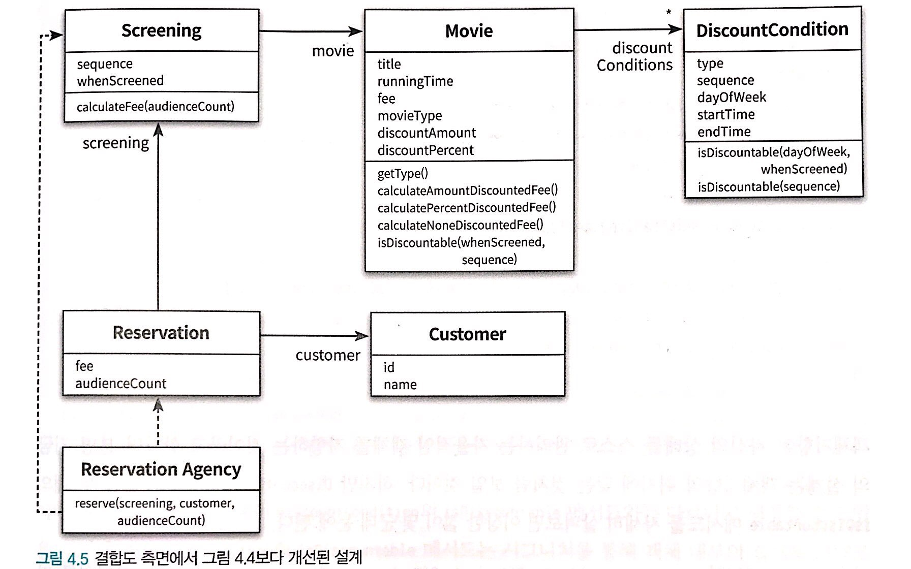

# 설계 품질과 트레이드오프
- 설계는 변경을 위해 존재하고 변경에는 어떤 식으로든 비용이 발생한다. 
- 훌륭한 설계란 합리적인 비용 안에서 변경을 수용할 수 있는 구조를 만드는 것.

## 데이터 중심의 영화 예매 시스템
- 객체의 상태는 `구현`에 속한다.

### 영화를 예매하자
- 데이터 중심으로 설계 할 경우, type 별로 분기하여 동작하는 코드가 생성.
- 예를 들면, 할인 정책이 금액 or 비율 인지 아니면 없는지...


## 설계 트레이드 오프

### 캡슐화
- 객체지향이 강력한 이유는 한 곳에서 일어난 변경이 전체 시스템에 영향을 끼치지 않도록 파급효과를 적절하게 조절할 수 있는 장치를 제공.
- 변경될 가능성이 높은 부분을 `구현`이라고 부르고 상대적으로 안정적인 부분을 `인터페이스`라고 부른다.
- 설계가 필요한 이유는 요구사항이 변경되기 때문.
- 캡슐화가 중요한 이유는 불안정한 부분과 안정적인 부분을 분리해서 변경의 영향을 통제할 수 있기 때문.

### 응집도와 결합도
- 응집도는 객체 또는 클래스에 얼마나 관련 높은 책임들을 할당했는지를 나타냄.
- 객체 또는 클래스가 협력에 필요한 적절한 수준의 관계만을 유지하고 있는지를 나타냄.

- 좋은 설계란 오늘의 기능을 수행하면서 내일의 변경을 수용할 수 있는 설계.

## 데이터 중심의 영화 예매 시스템의 문제점

### 캡슐화 위반
- 과도한 접근자<sup>getter</sup>와 수정자<sup>setter</sup>를 가지게 되는데 이것을 사용하면 변경에 취약한 설계를 얻게 됨.

### 높은 결합도
- 제어로직을 갖고 있는 ReservationAgency 가 모든 데이터 객체에 의존.


### 낮은 응집도
- 변경의 이유가 서로 다른 코드들을 하나의 모듈 안에 뭉쳐놓았으므로 변경과 관련없는 코드들이 영향을 받게 됨. 
- 하나의 요구사항을 위해 여러 모듈이 수정되야 함.

```
단일 책임 원칙(Single Responsibility Principle)
- 클래스는 단 한가지의 변경 이유만을 가져야 한다는 것

- 그러나 여기에서 말하는 `책임`은 지금 껏 얘기한 역할, 책임, 협력 과는 다르며 `변경과 관련된 더 큰 개념`을 가리킴. 
```

## 자율적인 객체를 향해

### 캡슐화를 지켜라
- 속성의 가시성을 private로 설정했다고 해도 접근자와 수정자를 통해 속성을 외부로 제공하고 있다면 캡슐화를 위반한 것.
- Rectangle 예제에서 자신의 크기를 스스로 증가시키도록 `책임`을 이동.

### 스스로 자신의 데이터를 책임지는 객체
- 첫번째 데이터 중심의 영화 예매시스템보다는 책임의 이동이 발생하여 스스로 구현.



## 하지만 여전히 부족하다

### 캡슐화 위반
- 기간조건을 판단하는 메소드에서 LocalDatetime의 정보가 인스턴스변수로 포함된다는 사실을 외부에 노출. 또한 sequence도 마찬가지.

```java
public class DiscountCondition {
	public boolean isDiscountable(LocalDatetime whenScreened, ins sequence)
}
```
- Movie 클래스에서도 getMovieType(), calculateAmountDiscountedFee(), calculatePercentDiscountFee()... 등등이 캡슐화를 위반.
```java
public class Movie {
	public MovieType getMovieType() {}
	public Money calculateAmountDiscountedFee() {}
	public Money calculatePercentDiscountFee() {}
}
```
- 캡슐화의 진정한 의미 : **변할수 있는 어떤 것이라도 감추는 것.**

### 높은 결합도
- 캡슐화 위반으로 인해 DiscountCondition의 내부 구현이 외부로 노출됐기 때문에 Movie와 DiscountContition 사이의 결합도는 높을 수 밖에 없음.

### 낮은 응집도
- 하나의 변경을 수용하기 위해 코드의 여러곳을 동시에 변경해야 함.

## 데이터 중심 설계의 문제점
- 데이터 중심의 설계는 본질적으로 너무 이른시기에 데이터에 관해 결정하도록 강요.
- 협력이라는 문맥을 고려하지 않고 객체를 고립시킨채 오퍼레이션을 결정

### 데이터 중심 설계는 객체의 **행동** 보다는 **상태**에 초넘을 맞춘다
- 데이터는 구현의 일부
- 너무 이른 시기에 데이터에 대해 고민하면 캡슐화에 실패

### 데이터 중심 설계는 객체를 고립시킨 채 오퍼레이션을 정의하도록 만든다
- 협력이라는 문맥 안에서 필요한 책임을 결정하고 이를 수행할 적절한 객체를 찾는 것이 중요.
- 올바른 객체지향 설계의 무게 중심은 객체 내부가 아니라 **외부**
- 인터페이스에 구현의 일부가 노출되어있는데, 이것은 협력이 구현의 세부사항에 종속되는 결과를 가져옴.


