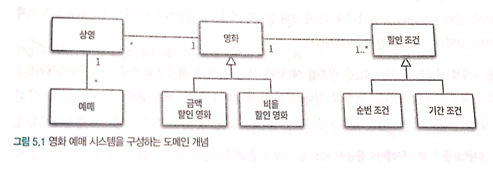

# 메시지와 인터페이스
- 클래스는 개발자가 직접 만지고 실험해볼 수 있는 `도구`일 뿐.
- 객체지향 애플리케이션의 가장 중요한 `재료`는 클래스가 아니라 `메시지`

## 협력과 메시지

### 메시지와 전송
- 메시지는 객체들이 협력하기 위해 사용할 수 있는 유일한 `의사소통 수단`.


 
- 동일한 문제를 해결할 수 있는 다양한 책임 할당 방법이 존재하며 이 과정은 일종의 트레이드 오프 활동임.
- 올바른 책음을 할당하기 위해 다양한 관점에서 설계를 평가할 수 있어야 함.

## 책임 주도 설계를 향해
- 데이터보다 행동을 먼저 결정하라
- 협력이라는 문맥 안에서 책임을 결정하라.

### 데이터보다 행동을 먼저 결정하라
- 데이터는 객체가 책임을 수행하는 데 필요한 재료를 제공할 뿐,.
- 곧 행동이 중요하는 뜻이며, 행동은 객체의 책임을 의미

### 협력이라는 문맥 안에서 책임을 결정하라
- 객체의 입장에서 책임이 조금 어색하더라도 협력에 적합하다면 그 책임은 좋은것.
- 협력에 적합한 책임을 수확하기 위해 객체를 결정한 후에 메시지를 선택하는 것이 아니라 메시지를 결정한 후에 객체를 선택할 것

### 책임 주도 설계
```
- 시스템이 사용자에게 제공해야 하는 기능인 시스템 책임을 파악한다. 
- 시스템 책임을 더 작은 책임으로 분할한다. 
- 분할된 책임을 수행할 수 있는 적절한 객체 또는 역할을 찾아 책임을 할당. 
- 객체가 책임을 수행하는 도중 다른 객체의 도움이 필요한 경우 이를 책임질 적절한 객체 또는 역할을 찾는다. 
- 해당 객체 또는 역할에게 책임을 할당함으로써 두 객체가 협력하게 한다. 
```

- 책임 주도 설계의 핵심은 책임을 결정한 후에 책임을 수행할 객체를 찾는 것.

## 책임 할당을 위한 GRASP 패턴
- General Responsibility Assignment Software Pattern<sup>일반적인 책임 할당을 위한 소프트웨어 패턴</sup> 의 약자로 객체에게 책임을 할당할 때 지침으로 삼을 수 있는 원칙들의 집합을 패턴형식으로 정리.

### 도메인 개념에서 출발하기
- 설계를 시작하기 전 도메인에 대한 개략적인 모습을 그려볼 것



- 시작 시점에는 너무 많은 시간을 들이지말고 빠르게 설계와 구현을 진행할 것

### 정보 전문가에게 책임을 할당하라
- 책임을 수행하는 데 필요한 정보를 갖고 있는 객체에게 할당하라. 

### 높은 응집도와 낮은 결합도
- 설계는 트레이드 오프 활동이라는 것을 기억할 것.

- LOW COUPLING : 어떻게 하면 의존성을 낮추고 변화의 영향을 줄이며 재 사용성을 증가 시킬 수 있을까?
```
예를 들면, 예매 요금을 계산하는 방식이 변경될 경우 Screening 도 함께 변경되어야 하는데, Screening과 DiscountCondition 이 협력하게 되면 Screening은 서로 다른 이유로 변경되는 책임을 짊어지게 되므로 응집도가 낮아짐.
```
- HIGH COHESION : 어떻게 복잡성을 관리할 수 있는 수준으로 유지할 것인가?
```
Movie의 주된 책임은 영화 요금을 계산하는 것, 영화 요금을 계산하는 데 필요한 할인 조건을 판단하기 위해 Movie가 DiscountCOndition과 협력하는 것은 응집도에 아무런 해도 끼치지 않음.
```

### 창조자에게 객체 생성 책임을 할당하라
- 결과적으로 Reservation 인스턴스를 생성하는 것인데, 아래 조건을 최대한 많이 만족하는 B는 Screening이다.
```
- B가 A 객체를 포함하거나 참조한다.
- B가 A 객체를 기록한다.
- B가 A 객체를 긴밀하게 사용한다.
- B가 A 객체를 초기화하는데 필요한 데이터를 가지고 있다.
```

## 구현을 통한 검증

### DiscountCondition 개선하기
- 변경에 취약한 클래스를 포함하고 있음.
```
예를 들면 
1. 새로운 할인 조건 추가 : isSatisfiedBy 메서드의 분기문을 수정해야함 
2. 순번조건을 판단하는 로직 변경 : isSatisfiedBySequence 메서드의 내부구현을 수정해야 함 
3. 기간 조건을 판단하는 로직이 변경되는 경우 : isSatisfiedByPeriod 메서드의 내부구현을 수정해야 함
```

- 인스턴스 변수가 초기화 되는 시점을 보자. 응집도가 높은 클래스는 인스턴스를 생성할 때 모든 속성을 함께 초기화 함.
- 함께 초기화되는 속성을 기준으로 코드를 분리할 것

### 다형성을 통해 분리하기
- SequenceCondition 과 PeriodCondition은 아무 차이도 없음. 같은 역할임


#### POLYMORPHISM
```
객체의 타입에 따라 변하는 로직이 있을때는 타입을 명시적으로 정의하고 각 타입에 다형적으로 행동하는 책임을 할당하라. 
예를 들면, 조건을 if ~ else 로 설계한다면 새로운 변화에 무조건 코드를 수정해야 함. 다형성을 이용해 새로운 변화를 다루기 쉽게 확장하라.
```

#### PROTECTED VARIATIONS
```
새로운 할인 조건이 추가된다고 하더라도 DiscountConditions이라는 역할이 Movie로부터 PeriodCondition과 SequenceCondition의 존재를 감춤.
이렇게 함으로써 변화와 불안정성이 다른 요소에 나쁜 영향을 미치지 않게 함.
```


### 변경과 유연성
- 코드를 이해하고 수정하기 쉽도록 최대한 단순하게 설계하는 방법, 변경을 유연하게 수용하도록 만드는 방법.
- 보통은 전자가 더 좋은 방법이지만, 유사한 변경이 반복적으로 일어날 경우 복잡성이 상승하더라도 유연성을 추가하는 두번째 방법이 더 좋음.


