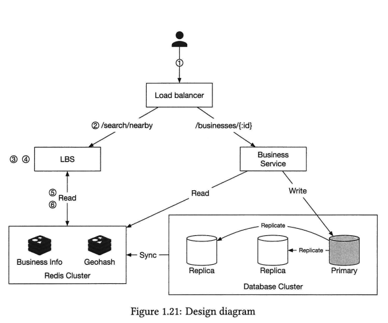

# Proximity Service

- yelp 와 같은 앱의 기능 구현을 위한 인터뷰
- 기능적 요구사항
	- 사용자의 위치에 기반하여 모든 사업장을 리턴
	- 사장님은 업종을 추가 삭제 업데이ㅡ 할수 있고 리얼타임은 아님.
	- 고객은 업장의 상세정보를 볼수 있음.
- 비기능적 요구사항 
	- 낮은 응답시간. 고객읜 빠르게 주변 업장을 찾을수 있어야 함.
	- 위치정보는 개인정보이므로 적절히 다룰것.
	- ha와 확장성을 고려해야 함. 

## Step 2 - Propose High-level Design and Get Buy-in

### Data model
- For a read-heavy system, a RDB such as MySQL can be a good fit. 

## High-level Design


### Location-based service(LBS)
- read-heavy service with no write requests. 
- 특히 밀집 지역의 peak hour에 QPS는 높다.
- 상태없는 서비스이고, 수평적으로 스케일하기 쉽다.

### Database cluster
- primary-secondary 셋텁 
- primary 는 write 만 수행, 남은 replica 들이 read 수행. 데이터 불일치 가능성 있음.

### Algorithms to fetch nearby businesses
- 보통의 회사들은 지리공간 DB로 such as Geohash in Redis나  Postgres with PostGIS extension 을 사용.

#### Option 1: Two-dimensional search
```SQL
SELECT business_id, latitude, longitude,
FROM business
WHERE (latitude BETWEEN {:my_lat} - radius AND {:my_lat} + radius)
AND
(longitude BETWEEN {:my_long} - radius AND {:my_long} + radius) 
```
- 범위의 업장을 fetch 하려면 두개 컬럼의 교차연산이 필요한데, 각 경도 위도의 범위가 너무 커서 원하는 성능이 나오지않음. 

- 1차원 적인 쿼리는 인덱스로 커버할 수 있으나, 2차원의 데이터를 얻기는 쉽지 않음.

- 널리 알려진바에 의하면 지리공간 인덱싱 방법은 아래와 같은 두가지 방식이 존재...   


- 두 방법의 구현은 달라도 아이디어는 비슷한데, 쿼리속도를 빠르게 하기 위해 `지도를 작은 크기로 잘라서, 인덱싱을 먹인다는 점`은 비슷함.

#### Option 2: Evenly divided grid
- 균등하게 지도를 나누는 방법
- 도시의 밀집도와 사막, 바다의 밀집도가 다르므로 이슈가 있음...

#### Option 3: Geohash
- 경도와 위도를 하나의 스트링으로 reducing 하는 방법
- 지도를 4분면으로 계속해서 나누어서 계산하면 아래와 같은 범위를 커버

- 그러나 boundary 이슈가 있음. 같은 해쉬값 prefix 라면 근처라는 가정이 깨짐. 4분면의 분면이 다르면 근처라고 하더라도 해쉬값이 많이 변경됨.
```SQL
SELECT * FROM geohash_index WHERE geohash LIKE '9q8zn% 
```
- 위와 같은 쿼리로 검색시 실제 근처지만, 쿼리 불가능.


#### Option 4: Quadtree
- 쿼드트리는 2차원 공간을 반복적으로 4분면으로 나누어 특정한 조건의 장소를 찾는 자료구조.
- DB 스트럭쳐는 아님 in-memory 스트럭쳐 
- 그래서 서버 스타트 업 시간에 200million 업종의 쿼드트리를 생성하며, 몇분이 채 걸리지 않음.
- 블루/그린 배포는 좋지 않고(qps가 높아질 듯, ) 점진적으로 미리 진행해놓는것이 좋을 것 같다.(사장님의 업장 변경사항은 내일 반영된다던지...)


#### Option 5: Google S2
- in-memory solution
- geofencing 을 위한 좋은 도구. 
- 힐버트 곡선? 을 사용한 알고리즘인데, 인터뷰에서 설명하기는 어려우니, geohash or quadtree 를 추천


#### Geohash vs quadtree
- Geohash
```
- 구현이 편하고 트리를 구성하지 않아도 됨.
- 특정 구역의 비지니스 반환을 지원
- 인덱싱 업데이트에 용이.
- 인구 밀집도에 따른 동적 그리드 사이즈 적용은 별도의 작업이 필요.
```

- Quadtree
```
- 구현이 약간 어렵고, 구현에 트리가 필요함.
- k-nearest 알고리즘 지원
- 인덱싱 업데이트는 지오해시보다 조금 복잠함. 
- 인구 밀집도에 따른 동적 그리드 사이즈 적용 가능.
```


## Step 3 - Design Deep Dive

### Geospatial index table
- 하나의 geohash 값에 여러개의 비지니스 아이디를 매핑하는것을 추천.
- 락을 잡지 않아도 되고(어차피 composite key이니...)

### Scale the geospatial index
- 샤딩 vs read replica 를 둘것인지.
- 샤딩의 접근은 조심스러워야 함. 어플리케이션 레이어에 침투하기 때문.
- 그러나 현재 요구사항은 샤딩보다는 레플리카를 두는것을 추천. 

### Caching
- 캐싱은 현재로서는 불필요. read-replica 로 충분히 극복 가능.
- 캐싱을 논할때는 항상 밴치마킹과 비용분석을 통해 진행하라. p26 중요.

### Cache key
- Geohash/Quadtree 를 키로 하는것이 좋음.


## Final design diagram


- 500미터안에 식당을 찾으려고 한다면, 클라이언트는 (latitude = 37.776720, longitude = —122.416730) and radius (500m) 를 로드밸런서로 전송
- 로드밸런서는 LBS로 포워딩
- LBS는 검색결과와 매치되는 geohash 길이를 찾는다. geohash-length = 6
- LBS는 근처의 geohash를 리스트로 계산한다. 
```
list_of_geohashes = [my_geohash, neighbor1_geohash, neighbor2_geohash,
..., neighbor8_geohash]. 
```
- list_of_geohashes 의 각 geohash로 Redis server에 businessIDs 들 반환
- 반환된 businessIDs로 BusinessInfo를 조회 하여 클라이언트에 제공.


