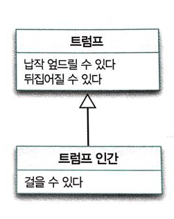

# 타입과 추상화

해리 벡이 만든 지하철 노선도는 추상화의 대표적인 것

- 지도가 가져야 하는 정확성을 버리고 목적에 집중한 결과.
- 꼭 알아야 하는 사실만 정확하게 표현, 몰라도 되는 사실은 제거.

### 추상화를 통한 복잡성 극복
복잡성의 총체인 **현실**을 그대로 수용하기에는 인간이 지니고 있는 **인지능력**과 **저장공간**이 너무나도 보잘것 없다는 것. 이것을 극복하기위해 본능적으로 현실을 분해하고 단순화 하는 전략을 따름.

> 진정한 의미에서 추상화란 현실에서 출발하되 불필요한 부분을 도려내가면서 사물의 놀라운 본질을 드러나게 하는 과정이라고 할 수 있다.

> \- Root-Bernstein 2001.

추상화란
어떤 양상, 세부사항, 구조를 좀 더 명확하게 이해하기 위해 특정 절차나 물체를 의도적으로 생략하거나 감춤으로써 복잡도를 극복하는 방법
이런 추상화는 두가지 차원으로 이루어지는데,

1. 구체적인 사물들 간의 공통점은 취하고 차이점은 버리는 일반화를 통해 단순하게 만드는 것이다.
2. 중요한 부분을 강조하기 위해 불필요한 세부 사항을 제거함으로써 단순하게 만드는 것이다.

> 객체지향 패러다임은 **객체**라는 추상화를 통해 현실의 복잡성을 극복한다.

### 객체지향과 추상화

#### 개념
객체지향 패러다임에서 공통적인 특성을 기준으로 객체를 여러 그룹으로 묶는데, 이러한 그룹을 **개념**concept 라고 한다. 
개념을 이용하면 객체를 여러 그룹으로 **분류**classification 할 수 있다. 또한 객체에 어떤 개념을 적용하는 것이가능해서 개념 그룹의 일원이 될 때 객체를 그 개념의 **인스턴스**instance 라고 한다.

> 객체는 특정한 **개념**을 적용할 수 잇는 구체적인 사물을 의미. 개념이 객체에 적용됐을 때 객체를 개념의 **인스턴스**라 한다.

#### 개념의 세 가지 관점
1. **심볼**symbol : 개념을 가리키는 간략한 이름이나 명칭
2. **내연**intension : 개념의 완전한 정의를 나타내며 내연의 의미를 이용해 객체가 개념에 속하는지 여부를 확인할 수 있음.
3. **외연**extension : 개념에 속하는 모든 객체의 집합

트럼프를 예로 들면

- 심볼 : 트럼프
- 내연 : 몸이 납작하고 두 손과 두 발은 네모 귀퉁이에 달려 있는 등장인물
- 외연 : 정원사, 병사, 신하, 왕자와 공주, 하객으로 참석한 왕과 왕비들, 하트 잭, 하트왕과 하트 여왕

> **개념**을 이용해 공통점을 가진 객체를 **분류**할 수 있다는 아이디어는 **객체지향** 패러다임이 **복잡성**을 극복하는 데 사용하는 가장 기본적인 **인지 수단**이기 때문이다.

#### 객체를 분류하기 위한 틀
어떤 객체를 마주했을 때 객체에게 적용할 개념을 결정하는 것은 개념의 객체 집합의 일원으로 맞아들인다는 것을 의미.

> 분류란 객체에 특정 개념을 적용하는 작업. 객체에 특정 개념을 적용하기로 결심했을때 우리는 그 객체를 특정한 집합의 멤버로 분류하고 있는 것이다.

**분류**는 객체지향의 가장 **중요한 개념**. 객체를 어떤 개념으로 분류할지가 객체지향의 품질을 결정. 적절하게 분류한 애플리케이션은 개발자에게 객체를 쉽게 찾고 조작할 수 있는 정신적인 지도를 제공.

#### 분류는 추상화를 위한 도구다
1. 추상화의 첫번째 차원은 구체적인 사물 간의 공통점은 취하고 차이점은 버리는 일반화를 통해 **단순화** 하는 것.
2. 추상화의 두번째 차원은 중요한 부분을 강조하기 위해 불필요한 세부 사항을 제거해 **단순화** 하는 것.

### 타입
#### 타입은 개념이다.
개념이라는 단어를 컴퓨터 공학자들이 고상하게 사용하기 위해 타입type이라는 단어를 수학으로부터 차용했다.

> 타입은 개념과 동일. 타입이란 우리가 인식하고 있는 다양한 사물이나 객체에 적용할 수 있는 아이디어나 관념을 의미. 어떤 객체에 타입을 적용할 수 있을 때 그 객체를 타입의 **인스턴스** 라고 한다. 타입의 인스턴스는 타입을 구성하는 외연인 객체 집합의 일원이 된다.

#### 데이터 타입
타입 시스템의 목적은 데이터가 잘못 사용되지 않도록 제약사항을 부과하는 것. 

타입은...

1. 데이터가 어떻게 사용되느냐에 관한 것. 데이터에 어떤 연산자를 적용하느냐에 따라 데이터의 타입을 결정.
2. 타입에 속한 데이터를 메모리에 어떻게 표현하는지를 외부에 철저하게 감춰진다. 

> 데이터 타입은 메모리 안에 저장된 데이터의 종류를 분류하는 데 사용하는 메모리 집합에 관한 메타데이터 이다. 데이터에 대한 분류는 암시적으로 어떤 종류의 연산이 해당 데이터에 대해 수행될 수 있는지를 결정한다. 

#### 객체와 타입
객체지향 프로그래밍을 할 때 우리는 객체를 일종의 데이터 처럼 사용하지만 그렇지 않다. 객체에서 중요한 것은 **행동**이다.
상태는 행동의 결과로 초래된 부수효과를 쉽게 표현하기 위해 도입한 추상적인 개념일 뿐. 객체를 만들때 가장 주용하게 고려해야하는 것은 이웃하는 객체와 협력하기 위해 어떤 행동을 하는지 결정하는 것.

#### 행동이 우선이다
결과적으로 동일한 책임을 수행하는 일련의 객체는 동일한 타입에 속한다고 말할수 있다.

같은 타입에 속한 객체는 행동만 동일하다면 서로 다른 데이터를 가질 수 있다.다형성에 의미를 부여

훌륭한 객체지향 설계는 외부에 **행동**만을 제공하고 데이터는 행동 뒤로 감춰야 한다. 또한 데이터 보다는 객체가 외부에 제공해야 하는 **행동**을 먼저 생각해야 한다.
데이터를 먼저 결정하고 객체의 책임을 결정하는 방법은 유연하지 못한 설계라는 악몽을 초래.

그래서...
**책임-주도 설계**Responsibility-Driven Design 라고 부르는 객체지향 설계 방법이 나왔는데, 이것은 데이터를 먼저 생각하는 **데이터-주도 설계**Data-Driven Design 의 단점을 개선하기 위해 고안됐다.

> 객체를 결정하는 것은 **행동**이다. 데이터는 단지 행동을 따를 뿐. 이것이 객체를 객체답게 만드는 가장 핵심적인 원칙이다.

### 타입의 계층
트럼프는 트럼프 인간을 포괄하는 좀 더 **일반적인 개념**이고, 트럼프 인간은 트럼프보다 좀 더 특화된 행동을 하는 **특수한 개념**이다. 이런 관계를 **일반화/특수화**generalization/specialization 관계 라고 한다.

#### 일반화/특수화 관계
일반화 / 특수화 관계를 결정하는 것은 객체의 상태를 표현하는 데이터가 아니라 객체의 **행동** 이라는 점.
중요한 것은 객체가 내부에 보관한 데이터가 아니라 객체가 외부에 제공하는 **행동**.

#### 슈퍼타입과 서브타입
일반화/특수화 관계에서 좀 더 일반적인 타입을 **슈퍼타입**Supertype이라고 하고 좀 더 특수한 타입을 **서브타입**Subtype 이라고 한다.
다시 한 번 말하지만, 슈퍼타입과 서브타입에서 중요한 것은 두 타입간의 관계가 **행동**에 의해 결정된다는 점.

> 따라서 어떤 타입을 다른 타입의 서브 타입이라고 말할 수 있으려면 다른 타입을 **대체**할 수 있어야 한다.

> - Liskov 1988

일반화/특수화 관계를 표기하는 방법은 아래와 같이 **일반적인 슈퍼타입**을 위에, **특수한 서브타입**을 아래에 위치시키고 속이 빈 삼각형으로 연결하여 표현. 
서브타입에서는 슈퍼타입과 중복된 행위를 생략할 수 있다. 슈퍼타입의 행동은 서브타입에게 자동으로 **상속**.

#### 일반화는 추상화를 위한 도구다
객체지향 패러다임을 통해 세상을 바라보는 거의 대부분의 경우에 **분류**와 **일반화/특수화 기법**을 동시에 적용하게 한다. 

### 정적 모델

#### 타입의 목적
타입을 사용하는 이유는 인간의 인지 능력으로는 시간에 따라 동적으로 변하는 객체의 복잡성을 극복하기가 너무 어렵기 때문.

> 타입은 시간에 따라 동적으로 변하는 앨리스의 **상태**키나 몸무게 등등를 시간과 무관한 **정적인** 모습으로 다룰 수 있게 해줌.

#### 그래서 결국 타입은 추상화다.
어떤 시점에 따라 앨리스를 생각할 때 불필요한 **상태변화**시간에 따른 변화.. 라는 요소를 제거하고 철저하게 정적인 관점에서 앨리스의 모습을 묘사하는 것을 가능하게 해줌.

> 타입은 추상화다. 타입을 이용하면 객체의 동적인 특성을 추상화할 수 있다. 결국 타입은 시간에 따른 객체의 상태 변경이라는 복잡성을 단순화할 수 있는 효과적인 방법

#### 동적 모델과 정적 모델
객체는 두가지 모델을 동시에 고려하는데. 

하나는.... 

**UML**객체지향 모델링일 위한 표준언어 에서 **스냅샷**객체가 특정시점에 구체적으로 어떤 상태를 가지느냐를 객체의 스냅샷이라고 한다은 **객체 다이어그램**Object Diagram 이라고 불린다. 
스냅샷 처럼 실제로 객체가 살아 움직이는 동안 상태가 어떻게 변하고 행동하는지를 포착하는 것을 **동적 모델**dynamic model 이라고 한다. 

둘째는...

객체가 가질수 잇는 모든 상태와 행동을 시간에 독립적으로 표현하는 **타입 모델**type model이 있다. 보통은 동적으로 변하는 객체의 상태가 아니라 객체가 속한 타입의 정적인 모습을 표현하기 때문에 **정적 모델**static model 이라고도 한다.

> 코드를 작성하는 시점에는 정적인 시점에서 접근하지만, 애플리케이션을 실행하고 디버깅하는 시점에는 동적인 시점에서 접근한다. 훌륭한 프로그래머가 되기 위해서는 적절히 두가지 관점 모두를 다뤄야 한다.

#### 클래스
객체지향 프로그래밍 언어에서 정적인 모델은 **클래스**를 이용해 구현된다. 타입을 구현하는 가장 보편적인 방법이 **클래스** 일 뿐 이지, 클래스와 타입은 동일한 것이 아니다.
**클래스**는 단순히 **타입**을 **구현** 할 수 잇는 수단일 뿐.

> 객체를 분류하는 기준은 **타입**이며, 타입을 나누는 기준은 객체가 수행하는 **행동**이라는 사실이 중요.

