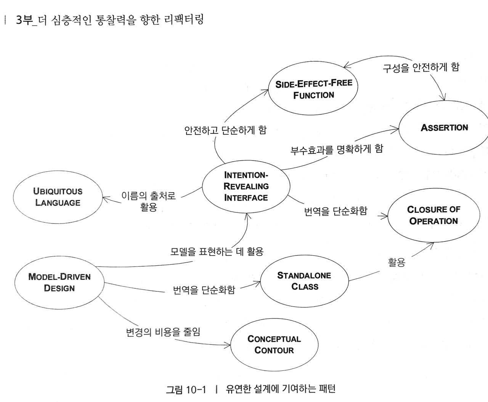
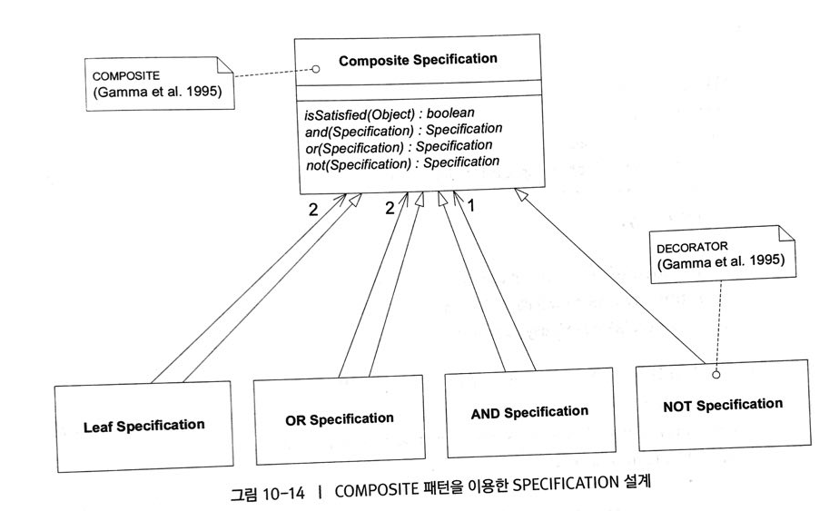

# 유연한 설계

정교한 시스템을 만들 목적으로 이해하기도 쉽고 조립가능하게 만드려면 MODEL-DRIVEN DESIGN을 적당한 수준의 엄밀한 **설계형식**과 **접목**하고자 노력해야 한다. 단순한 모델을 새로 만들거나 사용하자면, 상대적으로 복잡한 설계가 필요할 수도 있다. **유연한 설계**는 모델이 지닌 잠재력을 명백하게 표현하는 하부의 **심층모델**을 드러낸다.

레거시 코드를 유지보수하느라 허우적 댈 것인지, 복잡도의 한계를 뜷고 전진할 것인지의 차이를 결정하는 것은, 가장 **중요**하고 **난해**한 부분을 잘 다듬어 **유연한 설계**로 이끌어 내는 작업이다.



## INTENTION-REVEALING INTERFACE(의도를 드러내는 인터페이스)

객체가 아름다운 이유는 까다로운 세부내용을 모두 **캡슐화**할 수 있고, 캡슐화된 코드는 단순하고 상위수준의 개념 관점에서 **이해**하기 쉽기 때문이다.

> 개발자가 컴포넌트를 사용하기 위해 컴포넌트 구현의 세부사항을 고려해야 한다면 캡슐화의 가치는 사라진다. 
> 추측하여 작성한 코드가 당장은 정상 동작했다고 하더라도 설계의 개념적 기반은 무너지고 개발자들은 서로 의도가 거긋난 상태로 일하게 된다.
> **클래스와 메소드의 이름**은 개발자간의 의사소통을 개선하고 시스템추상화를 향상시킬 아주 좋은 **기회**이다.

설계에 포함된 모든 공개된 요소가 조화를 이루어 인터페이스를 구성하고, 각 요소의 이름을 토대로 설계의도를 드러낼 수 있는 기회를 얻게된다.(타입이름, 메소드이름, 인자 이름이 모두 결합되어 **INTENTION-REVEALING INTERFACE** 가 된다.)

예 : 페인트 혼합 애플리케이션

## SIDE-EFFECT-FREE FUNCTION(부수효과가 없는 함수)
연산은 크게 명령과 질의라는 두가지 범주로 나눌수 있다. 
- 질의 : 변수 안에 저장된 데이터에 접근하거나, 저장된 데이터를 기반으로 계산을 수행해서 시스템으로부터 정보를 얻는 연산.
- 명령 : 변수의 값을 변경하는 등의 작업을 통해 시스템의 상태를 변경하는 연산.

> 부수효과 : 의도하지 않은 영향력을 발생시키는 효과.
> 함수 : 부수효과를 일으키지 않으면서 결과를 반환하는 연산.


명령(상태를 변경하는 관찰가능한 메소드)을 도메인 정보를 반환하지 않는 아주 **단순한 연산**으로 엄격하게 분리하라. 한걸음 더 나아가 책임에 적합한 어떤 개념이 나타난다면 **복잡한 로직**을 **VALUE OBJECT**로 옮겨서 부수효과를 통제하라.

## ASSERTION(단언)
ASSERTION을 사용하면 ENTITY의 부수효과가 명확해지고 다루기 쉬워진다.

> 연산의 부수효과가 단지 **구현**에 의해서만 함축적으로 정의될 때 다수의 위임을 포함하는 설계는 **인과관계**로 혼란스러워진다. 이렇게 되면 **캡슐화**의 가치가 사라지고, 구체적인 경로를 **추적**해야한다는 필요성으로 추상화가 무의미해진다. 

자동화된 단위 테스트를 작성하면 언어 차원에서의 지원 부족을 보완할 수 있다. **ASSERTION**은 절차가 아니라 상태에 대해서만 기술하므로 **테스트**로 작성하기가 쉽다.
인자를 변경하는 것은 매우 위험한 종류의 부수효과에 해당한다.

## CONCEPTUAL CONTOUR(개념적 윤곽)
요리책에 들어있는 **판에 박힌 규칙**은 효과적이지 않다. 도메인에는 잠재적인 일관성이 존재하므로 도메인의 일부 영역에서 적절한 모델을 발견하면 나중에 발견되는 다른 영역과도 **일관성**을 유지할 가능성이 높다. 새로 알게된 개념이나 요구사항을 코드에 적용하다 보면 **CONCEPTUAL CONTOUR** 가 나타난다.

> 결정을 내릴 때마다 자문해보자. **"이 개념이 현재 모델과 코드에 포함된 관계를 기준으로 했을때, 적절한 것인가?"** 혹은 **"현재 기반을 이루는 도메인과 유사한 윤곽을 나타내는가??"**
> 지속적인 리팩토링을 토대로 변경되는 부분과 변경되지 않는 부분을 나누는 중심 축을 식별하고, 변경을 분리하기 위한 패턴을 명확하게 표현하는 **CONCEPTUAL CONTOUR** 를 찾아라.

## STANDALONE CLASS(독립형 클래스)
의존성이 하나만 있더라도 동시에 두 개의 클래스를 고려해야하고, 그 관계의 본질을 생각해야 한다. MODULE과 AGGREGATE 모두 지나치게 얽히고 설키는 상호 의존성을 방지하는 것이 목적인데, 만약 그렇게 된다면, 개발자에게 **정신적 과부하**를 준다.

> 낮은 결합도는 객체 설계의 기본 원리다. 가능한 결합도를 낮추고자 노력하고 현재 상황과 **무관한** 모든 개념을 **제거**하라. 독립적인 클래스는 MODULE을 이해하는데 따르는 부담을 덜어준다. 
> 모든 의존성을 제거하는 것이 아니라 모든 비본질적인 의존성을 제거하는 것이 목적.

## CLOSURE OF OPERTAION(연산의 닫힘)
적절한 위치에 **반환 타입**과 **인자 타입**이 동일한 연산을 정의 하라. 닫힌연산은 부차적인 개념을 사용하지 않고도 고수준의 인터페이스를 제공한다.
이러한 패턴은 소프트웨어를 분명하고, 예측 가능하며, 전달력 있게 만든다면 추상화와 캡슐화의 목표를 효과적으로 달성할 수 있다.

## 선언적 설계
일반적으로 일종의 실행가능한 명세<sup>executable specification</sup>로서 프로그램 전체 혹은 일부를 작성하는 방식.

> 선언적인 접근법을 통해 가장 큰 가치를 얻었던 경험은 아주 좁은 범위로 한정된 프레임워크를 사용해서 영속성과 객체 관계형 매핑을 자동화 한 경우가 있다.

## 도메인 특화 언어
특정 도메인을 위해 구축된 특정 모델에 맞게 조정된 프로그래밍 언어

> UBIQUITOUS LANGUAGE와 가장 높은 일관성을 유지할 수 있지만, 개발자가 배우기 힘들다는 단점과, 다른 모델과의 연결이 자연스럽지 못하다는 단점을 갖고 있다.

## 선언적인 형식의 설계

### SPECIFICATION을 선언적인 형식으로 확장하기

```java
public interface Specification {
	boolean isSatisfiedBy(Object candidate);
	Specification and(Specification other);
	Specification or(Specification other);
	Specification not();
}
```
SPECIFICATION은 일반화된 기능을 지니고있으므로 추상클래스나 인터페이스를 만드는 것이 여러모로 유용하다.

```java
public class ContainerSpecification implements Specification {
	private ContainerSpecification requiredFeature;

	public ContainerSpecification(ContainerSpecification required) {
		requiredFeature = required;
	}

	boolean isSatisfiedBy(Object candidate) {
		if (!candidate instanceof Container) return false;

		return (Container) candidate.getFeatures().contains(requiredFeature);
	}
}
```
위와 같이 일반적인 Specification으로 선언하면 아래의 저렴한 컨테이너를 최적화된 형태로 설계할 수 있다.
```java
Specification cheap = (ventilated.not()).and(armored.not()); // 통풍이 필요없고, 강화 컨테이너가 아니어도 된다.
```

COMPOSITION 패턴을 이용한 SPECIFICATION 설계



```java
public abstract class AbstractSpecification implements Specification {
	public Specification and(Specification other) {
		return new AndSpecification(this, other);
	}

	public Specification or(Specification other) {
		return new OrSpecification(this, other);
	}

	public Specification not() {
		return new NotSpecification(this);
	}
}

public class AndSpecification extends AbstractSpecification {
	Specification one;
	Specification other;
	public AndSpecification(Specification x, Specification y) {
		one = x;
		other = y;
	}
	public boolean isSatisfiedBy(Object candidate) {
		return one.isSatisfiedBy(candidate) && other.isSatisfiedBy(candidate);
	}
}

public class OrSpecification extends AbstractSpecification {
	Specification one;
	Specification other;
	public OrSpecification(Specification x, Specification y) {
		one = x;
		other = y;
	}
	public boolean isSatisfiedBy(Object candidate) {
		return one.isSatisfiedBy(candidate) || other.isSatisfiedBy(candidate);
	}
}

public class NotSpecification extends AbstractSpecification {
	Specification wrapped;	
	public NotSpecification(Specification x) {
		wrapped = x;
	}
	public boolean isSatisfiedBy(Object candidate) {
		return !wrapped.isSatisfiedBy(candidate);
	}
}
```
위와 같은 완전한 **일반화**가 대부분 필요하지 않을 수도 있다. 하지만 **AND**연산이 다른 연산에 비해 많이 **나타나고** 복잡도도 낮다. 필요한 연산이 AND 뿐이라도 이렇게 작성하도록 하자. 이렇게 추가했을때 **언제**라도 부가적인 기능은 **추가**할 수 있다.


### 포섭관계
새로운 SPECIFICATION을 만족하는 임의의 대상은 기존의 SPECIFICATION 역시 만족 시키는데 이것을 바로 **포섭한다(subsume)** 이라고 한다.

```java
public class MinimumAgeSpecification {
	int threshold;

	public boolean isSatisfiedBy(Person candidate) {
		return candidate.getAge() >= threshold;
	}
	public boolean subsume(MinimumAgeSpecification other) {
		return threshold >= other.getThreshold();
	}
}
```
위의 포섭관계를 테스트 하기 위한 코드는 아래와 같다.
```java
drivingAge = new MinimumAgeSpecification(16); //운전을 위한 최소나이 16
votingAge = new MinimumAgeSpecification(18); //투표를 위한 최소나이 18
assertTrue(votingAge.subsume(drivingAge)); // 투표를 위한 나이는 운전을 위한 나이를 포섭한다.ㅏ
```

아리스토텔레스의 SPECIFICATION

모든 인간은 죽는다.
```java
Specification manSpec = new ManSpecification();
Specification mortalSpec = new MortalSpecification();
assert manSpec.subsume(mortalSpec);
```

아리스토텔레스는 인간이다.
```java
Man aristotle = new Man();
assert manSpec.isSatisfiedBy(aristotle);
```

고로, 아리스토텔레스는 죽는다.
```java
assert mortalSpec.isSatisfiedBy(aristotle);
```

## 받음각

### 하위 도메인으로 분리하라
시스템의 일부 측면에는 어떤 접근방식을 취해야 하는지에 관한 **암시**가 있으므로 그러한 **측면**을 뽑아낸 후 **개선**할 수 있다.

### 가능하다면 정립된 정형화를 활용하라
보통은 현재의 도메인이나 다른 도메인 영역에서 오랫동안 정립되어온 개념을 이용해서 적용할 수 있으며, 그것들은 몇 세기에 걸쳐 **정제**된 것들이다.


유연한 설계를 위해...
1. 복잡한 로직을 SIDE-EFFECT-FREE FUNCTION이 포함된 VALUE OBJECT내부로 캡슐화하라.
2. 상태를 변경하는 연산은 단순하며 ASSERTION을 이용해 SIDE EFFECT를 줄여라.
3. 모델간의 결합도를 낮춰라.(CLOSURE OF OPERTAION을 통해 메소드나 클래스를 특정 객체에 닫혀있게 만들어라.)