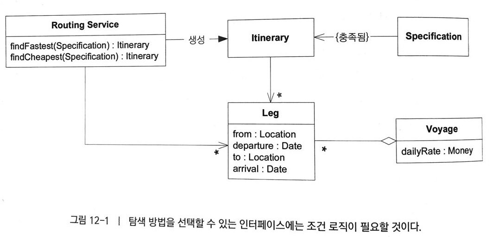
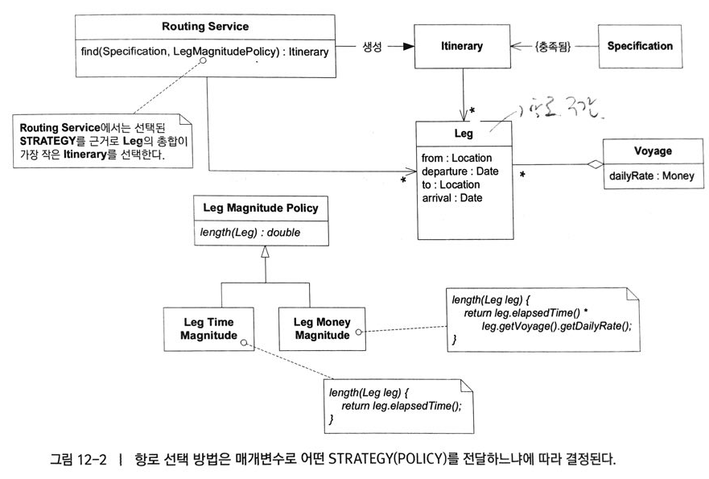
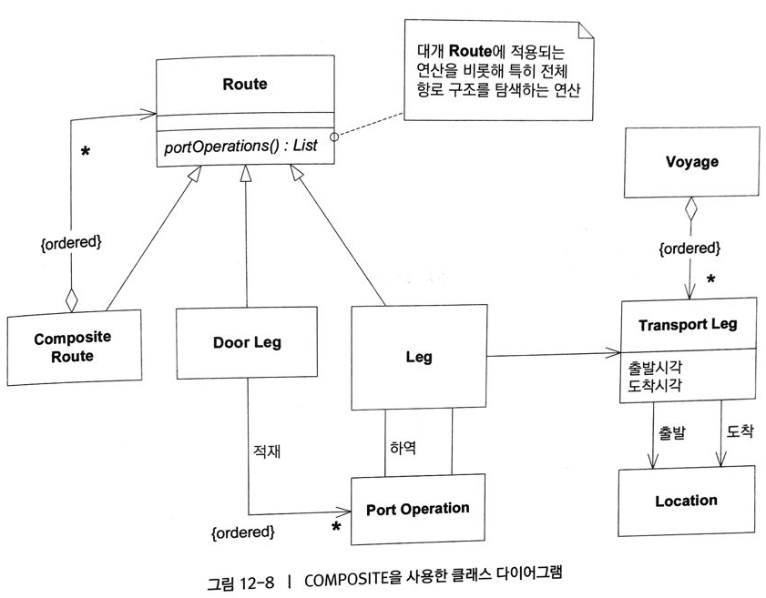
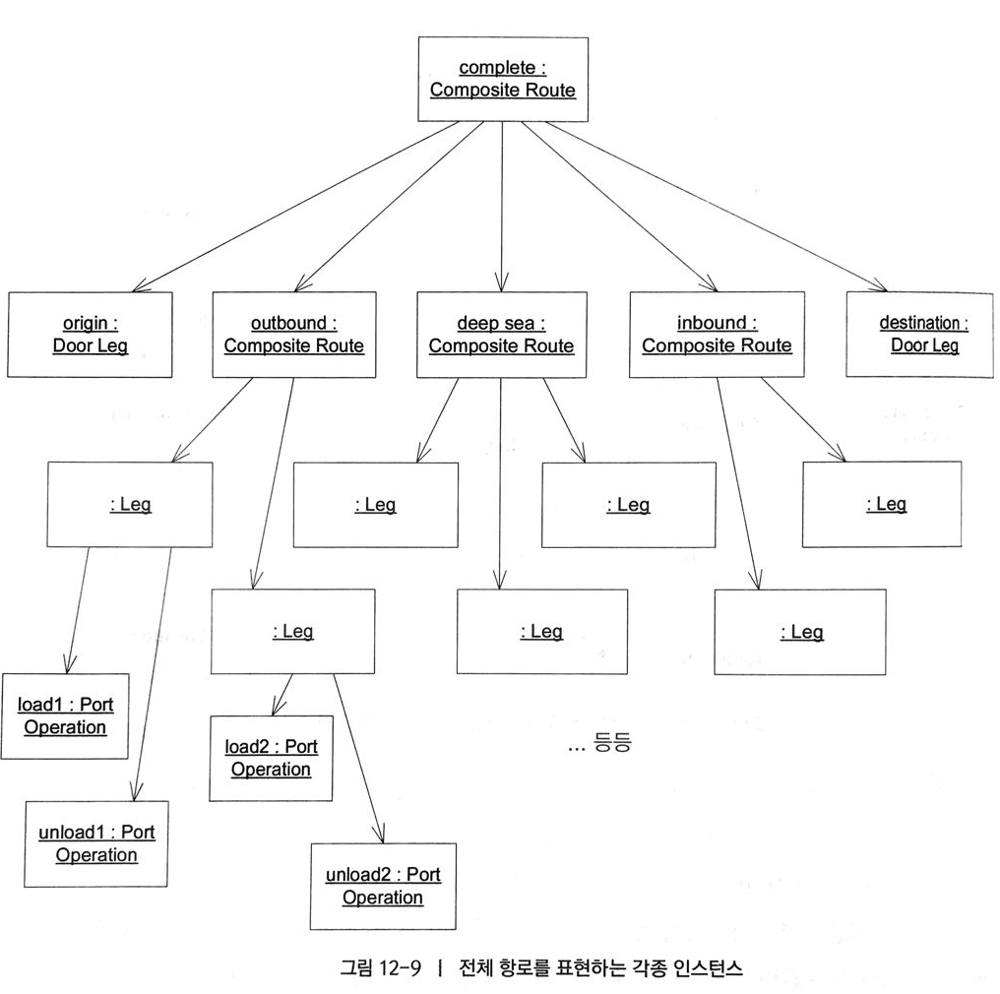

# 모델과 디자인 패턴의 연결

**디자인 패턴**과 **도메인 패턴**의 차이점
> 디자인 패턴은 특정한 상황에서 **일반적인 설계문제를 해결하**고자 상호 교류하는 수정 가능한 객체와 클래스에 관해 설명한다. 
> 디자인 패턴중 **일부** 만이 도메인 패턴으로 사용할 수 있다.(디자인 패턴에서 강조하는 사항을 도메인 패턴에 맞게 적절히 수정해야 한다.)
> 디자인 패턴은 순수하게 **기술적**이다. 그 중 **도메인에서 마주치는 의미**있는 개념에서 사용할 수 있다.

## STRATEGY(전략, POLICY[정책]라고도 함)

아래의 이슈를 해결하기 위해 **Strategy**를 사용.

> 도메인 모델에는 기술적인 이유로 필요한 것이 아니라 실제적으로 문제 도메인 관점에서 의미 있는 프로세스가 존재하는데, 여러 종류 중 하나를 선택해야 할 경우 적절한 프로세스를 선택하는데 따르는 복잡성과 다수의 프로세스가 존재한다는 사실 자체에 내포된 복잡성이 결합되어 감당하기 어려운 지경에 빠지기도 한다.

우리는 프로세스의 중심 개념과 변경되는 부분을 분리하고자 한다. 

> 프로세스에서 **변화하는 부분**을 별도의 **전략(Strategy)**로 분리해서 모델에 표현하라. 프로세스의 규칙과 프로세스를 제어하는 행위를 서로 분리하라. Strategy 디자인 패턴에 따라 **규칙**이나 **대체 가능한 프로세스**를 구현하라. 다양한 방식으로 변형된 전략 객체는 프로세스의 서로 다른 처리 방식을 표현한다.

Strategy를 **디자인패턴**으로 바라보는 전통적인 관점에서는 각기 다른 **알고리즘 간에 상호 대체**할 수 있는 능력에 중점을 두는 반면.

**도메인 패턴**으로 사용하는 관점에서는 **프로세스** 또는 **정책적인 규칙**과 같은 하나의 개념을 표현하는 능력에 중점을 둔다.

ex : 항로 탐색 정책

> Routing Specification이 Routing Service에 전달되면 Routing Service는 **SPECIFICATION**에 명시된 항목을 만족하는 상세한 Itinerary를 만들어낸다.

> Leg Magnitude Policy(구간 등급 정책)의 종류를 선택가능하도록 하는 **Strategy**를 적용하여 Routing Service에 표현된 가장 빠른 항로나 가장 저렴한 항로를 표현하기 쉬워졌다.

이렇게 함으로써 Routing Service는 선택한 Strategy를 기반으로 Leg의 총합이 가장 작은 Itinerary를 선택한다.

**도메인 계층**에서 **기술적인 디자인 패턴**을 사용할 때는 **부가적인 동기 부여**와 함께 별도의 의미계층을 추가해야 한다. 
**구현 기술**로서의 패턴이 그 자체만으로 가치가 있긴하지만 **Strategy**를 실제 **업무 전략**이나 **정책**과 연관시킬 때 패턴은 유용한 **구현 기술 이상의 가치**를 지닌다.

> 디자인패턴은 **기술적인** 부분이지만 **도메인에 연관**해서 사용하면 그 가치는 **유용한 구현 기술보다 더 크다. **

## COMPOSITE(복합체)

**중첩되어 있는 복합 객체 간의 관련성을 모델에 반영하지 않을 경우**composite패턴을 사용하지 않을 경우, 각 계층에 공통적인 행위를 중복시킬 수 밖에 없으며, 복합 객체안에 객체를 중첩할 수 있는 유연성을 잃게 된다. 또한, 각 계층에서 다루는 개념에 차이가 없더라도 클라이언트는 서로 다른 수준을 처리하기 위해 각기 다른 인터페이스를 사용해야 한다. 집계정보(Aggregate Information)를 얻기 위해 각 계층을 재귀적으로 탐색하는 작업은 매우 복잡하다.

만약 하위의 모든 부분이 실제로 동일한 유형의 개념으로 구성되는 추상화를 발견했다면정말로 도메인 개념 간의 부분/전체 계층구조가 존재 한다면,

> COMPOSITE 내부에 포함된 모든 **구성요소를 포괄**하는 **추상타입**을 정의하라. 컨테이너에 포함된 항목의 **집계정보**를 반환할 수 있게 정보를 제공하는 메서드를 컨테이너에 구현하라. 

ex : 여러 항로로 구성된 배송 항로

> Composite에서 하나의 항로는 다른 항로의 조합으로 구성되므로 서로 다른 수준의 항로를 동일하게 다루기에 적절하다.

> (이제는 매우 간단해진) 코드로 두 개념을 조합하는 방법에 관한 정보를 전달한다.

## 그렇다면 FLYWEIGHT 는?
[FLYWEIGHT???](https://blog.naver.com/jsqim21/221112693894)

- FLYWEIGHT는 **도메인 모델과**는 전혀 **관련이 없는** 디자인 패턴의 좋은 예이다. 
- 제한된 수의 **VALUE OBJECT**가 자주 사용될 경우 VALUE OBJECT를 **FLYWEIGHT 패턴**으로 구현하는 것이 적절하다. (VALUE OBJECT에는 FLYWEIGHT의 적용이 선택사항이지만, ENTITY는 아예 적용할 수 없다.)
