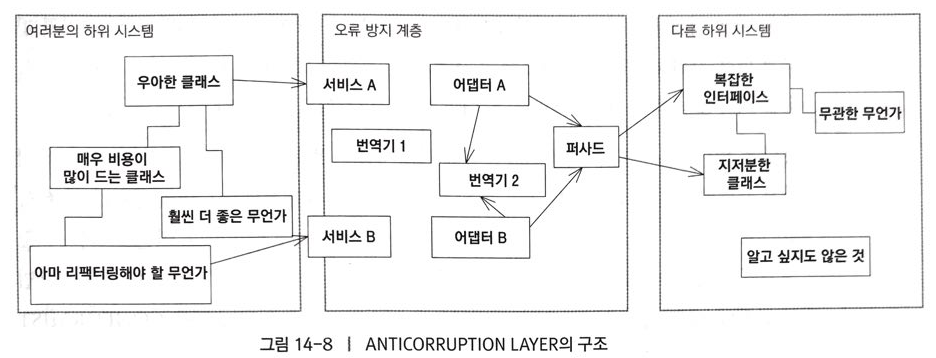

# 모델의 무결성 유지

대규모 시스템의 도메인 모델을 완전하게 단일화한다는 건ㅅ은 타당하지 않거나 비용대비 효과적이지 않다. 모델의 분화는 기술적 관심사 만큼이나 정치적인 분열과 다양한 경영상의 우선순위로 발생하기 마련. 완전한 통합을 가로막는 기술적 요인이 전혀 없더라도 프로젝트에는 다수의 모델이 나타난다.

그러나 이것을 그대로 두고만 볼 수 없다. 우리는 단일화 되기를 바라는 부분은 그대로 두고, 단일화 되지 않은 부분이 혼란을 초래하거나 다른부분을 손상시키지 않는지 확인해야 한다. 

> 우리에겐 다른 여러 모델간의 경계와 관계를 표시해줄 `수단`이 필요하다.

CONTEXT MAP이 프로젝트의 컨텍스트와 컨텍스트 간의 관계를 개괄적으로 보여주고, BOUNDED CONTEXT는 각 모델의 적용 가능성의 범위를 알려준다. 일단 컨텍스트가 제한되면 CONTINUOUS INTEGRATION 프로세스를 토대로 **모델의 단일화**를 유지할 수 있다.

## BOUNDED CONTEXT(제한된 컨텍스트)
서로 다른 모델을 다룰 경우, 컨텍스트에 적용하기 위한 판단이 명확하게 서지 않는 경우가 많다. 보통은 시스템이 예측불가능한 상태에 빠지고 나서야 모델에 차이가 발생했다는 사실을 깨닫는다. 만약 모순이 동일한 코드 기반에서 발생할 경우 이를 인식하기가 더욱 힘들다.

그러므로

모델이 적용되는 컨텍스트를 명시적으로 정의하라. `컨텍스트의 경계` 를 **팀조직**, **애플리케이션의 사용법**, **코드기반**이나 **데이터베이스 스키마** 같은 물리적인 형태의 관점에서 명시적으로 설정하라. 이 경계 내에서는 모델을 엄격하게 **일관된 상태**로 유지하고 경계 바깥의 이슈 때문에 초점이 흐려지거나 혼란스러워져서는 안된다.


> BOUNDED CONTEXT와 MODULE은 서로 동기가 다른 패턴이다. 
**두 객체 집합**이 각기 **다른 모델**을 구성한다면 두 객체 집합은 거의 항상 서로 다른 **개별 MODULE** 내에 위치한다.(물론 서로 다른 **네임스페이스**로 **경계**를 제공할 수 있다.) 그러나 MODULE은 단일 모델 내에 포함된 요소를 구성하는 데도 사용되며, 꼭 **개별 CONTEXT**만을 나타내는 것은 아님. BOUNDED CONTEXT 안에 MODULE이 만들어낸 개별 네임스페이스가 포함되면 모델의 단편화를 파악하기가 힘들긴 하다.

경계는 특별한 곳이므로 BOUNDED CONTEXT 와 BOUNDED CONTEXT 간의 관계를 보살핌과 주의가 필요하다. 

### BOUNDED CONTEXT 안의 균열 인식

1. 코드로 작성된 인터페이스가 서로 맞지 않는 경우.
2. 중복된 개념(실제로 같은 개념을 나타내느 두 개의 모델 요소)과 허위 동족 언어(같은 용어를 얘기하지만 실제로는 다른 개념)

위의 문제는 자동화된 테스트를 이용한 CONTINUOUS INTEGRATION 을 통해 문제점을 미리 파악할 수 있다.

## CONTINUOUS INTEGRATION

BOUNDED CONTEXT를 정의했다면 건전한 상태로 유지하자.

> 다수의 사람이 동일한 BOUNDED CONTEXT에서 작업할 경우 모델이 단편화 될 가능성이 높다. 팀의 규모가 커지면 문제가 증폭되지만, 서너 명의 소수인원도 심각한 문제를 야기할 수 있다. 그렇다고 시스템을 더 작은 CONTEXT로 분할한다면, 결국 가치 있는 수준의 통합과 응집성을 잃게 된다.

규모와 상관없이 **통합된 시스템**을 개발하는 데 필요한 수준의 **의사소통**을 **유지하기**는 **어렵다.** 기존 코드를 망가뜨릴지도 모른다는 두려움에 코드를 중복시키는 등의 소심한 행동을 방지해줄 안전망이 필요하다. XP에서 제시하는 각종 실천사항의 목표는 많은 사람들에 의해 지속적으로 수정되는 응집도 높은 설계를 유지하는 문제를 해결하는데 있다. 

> CONTINUOUS INTEGRATION 은 내부적으로 균열이 발생할 때 이를 빠르게 포착하고 정정할 수 잇을 정도로 컨텍스트 내의 모든 작업을 **빈번하게** **병합**해서 일관성을 유지하는 것을 말한다. 

가장 효과적인 프로세스

- 단계적이고 재생 가느한 병합/빌드 기법
- 자동화된 테스트 스위트
- 수정사항이 통합되지 않은 채로 존재하는 시간을 짧게 유지하는 규칙

> 단편화과 발생했다는 사실을 빠르게 알려줄 수 있는 자동화된 테스트와 함께 모든 코드와 그 밖의 구현 산출물을 빈번하게 병합하는 프로세스를 수립하라. 모델에 대한 시선의 차이를 극복하기 위해 **UBIQUITUOS LANGUAGE**를 사용하라.

## CONTEXT MAP(컨텍스트 맵)
문제 
1. 다른 팀에 속한 사람들은 CONTEXT 간의 경계를 인식하지 못한다.
2. 자신도 모르게 CONTEXT의 경계를 흐리게 하거나 연결되는 방식을 복잡하게 만든다.
3. 서로 다른 CONTEXT를 연결해야 하는 경우, CONTEXT를 서로에게 스며들게 한다.

BOUNDED CONTEXT간에 코드를 재사용하는 것은 위험.
CONTEXT MAP은 프로젝트 관리와 소프트웨어 설계 영역 사이에 걸쳐있는 개념.

> 프로젝트상의 유용한 모델을 식별하고 각 BOUNDED CONTEXT를 정의(비 객체지향 적인 하위 시스템에 대한 암시적인 모델도 포함)
> 의사소통을 위해 컨텍스트 간의 번역에 대한 윤곽을 명확하게 표현.
> 컨텍스트간에 공유해야 하는 정보는 강조함으로써 모델과 모델이 만나는 경계지점을 명확하게 하라.
> 각 컨텍스트의 영역을 나타내는 지도를 작성하라.(컨텍스트의 배치는 나중에 해도 된다!)


CONTEXT MAP은 형재 상황을 명확하게 표현하고 있다.(응집도 높게)

두 모델간의 번역을 수행하는 양방향 번역기
```note
Booking-Transport Network Translator

convertSpec(RouteSpecification spec) : List 
convertPath(List nodePath) : Itinerary
```

RoutingService의 유일한 연산
```java
public Itinerary route(RouteSpecification spec) {
	Booking_TransportNetwork_Translator translator = new Booking_TransportNetwork_Translator();

	List constraintLocations = translator.convertConstraint(spec);

	//NetworkTraversalService 에 접근
	List pathNodes = traversalService.findPath(constraintLocations);
	Itinerary result = translator.convert(pathNodes);
	return result;
}
```
그리 나쁘진 않다. 


### CONTEXT 경계에서의 테스트
다른 BOUNDED CONTEXT와 접촉 지점은 테스트 할때 특히 중요. 테스트는 귀중한 조기경보체계의 역할을 할 수 있으며, 특히 통제할 수 없는 모델의 세부사항에 의존할 때는 안심할 수 있게 해준다.

### CONTEXT MAP의 조직화와 문서화
팀의 모든 구성원이 서로 동일한 방식으로 개념적 경계를 이해하도록 활발히 의사소통해야 한다.
의사소통의 목적으로 예제와 같은 비공식적인 다이어그램도 좋다.

## SHARED KERNEL(공유 커널)
밀접하게 연관된 애플리케이션을 대상으로 작업중인 팀 간의 협력이 조율되지 않는다면 결과물을 조합하기 쉽지 않음. 
결국 처음부터 CONTINUOUS INTEGRATION을 적용했을 때 보다 더 많은 시간을 번역 계층을 개발하고 구조 개선하는데 허비하게 될 것이며, 동시에 UBIQUITOUS LANGUAGE를 구축하는 작업이 중복되고 UBIQUITOUS LANGUAGE로 얻을 수 있는 이점을 잃어버린다. 

> 두 팀간에 공유하기로 한 도메인 모델의 부분집합을 명시하라. 
> 기능 시스템을 더 자주 통합하라.(개별 팀에서 수행하는 CONTINUOUS INTEGRATION 빈도 보다는 적은 빈도로)
> 통합할 때는 양 팀에서 작성한 테스트를 모두 실행 할 것.

SHARED KERNEL의 목표는 중복(그렇다고 하나의 BOUNDED CONTEXT 처럼 중복을 완전히 제거하는 것은 아니다)을 줄이고 두 하위 시스템간의 통합을 비교적 용이하게 만드는 것.

## CUSTOMER/SUPPLIER DEVELOPMENT TEAM(고객/공급자 개발 팀)
상류와 하류 컴포넌트를 다루는 사용자 집단은 수행한느 업무가 상이하고 서로 달느 모델을 사용하는 편이 낫다.

문제
- 변경에 대한 거부권이 하류팀에 있거나 절차가 지나치게 복잡할 경우 상류팀의 개발이 하류팀에 속박당할 수 있다.
- 상류팀은 하류팀에 좋지 않은 영향을 미칠까 개발을 억제할지도 모른다.
- 하류팀은 상류팀의 우선순위에 좌지우지 된다.

해결방안
1. XP의 반복계획 프로세스
2. 두 팀 간에 명확한 고객/공급자 관계를 확립.
3. 결과로 예상되는 인터페이스를 검증하게 될 자동화된 인수테스트를 함께 개발.

> 테스트를 변경한다는 것은 인터페이스를 수정한다는 것이므로 테스트를 수정하려면 다른 팀과 협의해야함.

## CONFORMIST(준수자)
문제
- 상류팀이 하류팀의 필요성을 충족시킬 충분한 동기를 느낄 수 없다면 하류팀은 속수무책으로 무력해진다.
- [이타주의](https://terms.naver.com/entry.nhn?docId=1135668&cid=40942&categoryId=31532)를 발판삼아 상류 개발자들이 약속 할 수 있어도 실제 이행할 가능성은 낮다.

해결방법
1. 포기하는 방법
2. 전적으로 독립적인 모델을 포기
3. 복잡해질 가능성이 충분한 번역 계층을 개발(ANTICORRUPTION LAYER)

> CONFORMIST를 따를 경우, 상류팀에 속박되고 이상적인 모델은 아니지만 통합 자체는 매우 단순해진다.
> SUPPLIER와 UBIQUITOUS LANGUAGE를 같이 사용할 수 있는 이점이 있다.

CONFORMIST는 동일한 모델을 이용하는 영역과 추가를 통해 모델을 확장한 영역, 다른 모델이 영향을 미치는 영역을 보유한다는 점에서 SHERED KERNEL과 유사하지만 차이점은 의사결정과 개발과정에 있다.
SHAERD KERNEL은 밀접하게 조율하는 팀 간에,
CONFORMIST는 협력에 관심없는 팀과의 통합이다.

## ANTICORRUPTION LAYER(오류 방지 계층)

문제
- 다른 시스템과 상호작용하는 새로운 시스템을 구축에 필요한 모델을 연계하는 어려움으로 인해, 임시방편으로 새로운 모델을 기존 모델과 유사하게 수정할 경우 새로운 모델의 의도가 전체적으로 매몰된다.
- 레거시 시스템이 잘 만들어졌다고 하더라도, 현재 프로젝트에 적합한 모델이지 않은 경우가 대부분이다.

해결
1. 클라이언트 고유의 도메인 모델 측면에서 기능을 제공할 수 있는 격리계층을 만들것.
2. 필요에 따라 두개의 모델 양방향으로 번역할 수 도 있다.
3. ANTICORRUPTION LAYER는 개념적인 객체와 행위를 하나의 모델과 프로토콜에서 다른 모델과 프로토콜로 변환하기 위한 메커니즘.

### ANTICORRUPTION LAYER의 인터페이스 설계
간혹 ANTICORRUPTION LAYER의 공용인터페이스는 ENTITY의 형태를 띠기도 하지만 보통은 SERVICE의 집합이다.
응집력있게 만들자.

### ANTICORRUPTION LAYER의 구현
여러 시스템간의 상호작용에 필요한 통신 및 전송 메커니즘과 FACADE, ADAPTER, 번역기 를 조합하여 구현

FACADE
> 한쪽 모델에서 다른 모델로 번역하는 것은 상호작용하기 어려운 하위시스템의 인터페이스를 동시에 다루어야 함.(FACADE의 역할)
> 하위 시스템에 대한 클라이언트의 접근을 단순화 하고 더 쉽게 사용하도록 하는 인터페이스
> FACADE는 다른 시스템의 BOUNDED CONTEXT 에 속한다.

ADAPTER
> 행위를 구현하는 측애서 이해한 것과 다른 프로토콜을 클라이언트에서 사용하게 해주는 wrapper 에 해당.

번역기
> 개념 객체나 데이터의 실제 변환은 자체적인 객체에 둘 수 있는 개별적이고 복잡한 작업.
> 변환을 거쳐 개념 객체나 데이터를 모두 쉽게 이해할 수 있도록 한다.



1. ANTICORRUPTION LAYER는 양방향 일수도 있고, 다른 시스템에서 호출 가능하게 만들어야 할 수도 있다.
2. 가능한 한 자동화 테스트부터 시작하고 사용할 기능에 대해 명시적인 인터페이스를 만드려고 노력할 것.
3. 통합은 매우 비용이 높은 작업이다. 기존 모델의 무결성을 훼손하지 않도록 매우 조심스럽게 이행할 것.
4. 번역이 힘들 경우 하위시스템을 CONFORMIST<sup>준수자</sup>로 만들어 번역을 제거해도 된다.

ANTICORRUPTION LAYER는 두 개의 BOUNDED CONTEXT를 잇는 수단.

## SEPARATE WAYS(각자의 길)

통합에는 언제나 비용이 많이 든다. 때로는 통합의 혜택이 적은 경우도 있다.

> BOUNDED CONTEXT를 아주 단순한 형태로 유지해서 개발자들이 단순하고 특화된 해결책을 찾을수 있도록 하자.

## OPEN HOST SERVICE(오픈 호스트 서비스)

하위 시스템을 필요로 하는 곳이 많다면 좀더 유연한 접근법이 필요하다.

- 하위 시스템 접근과 관련된 프로토콜을 일련의 SERVICE로 정의하라.
- 프로토콜을 공개해서 시스템과 통합하고자 하는 사람들에게 사용할 수 있도록 하라.
- 새로운 요구사항을 받아들일 수 있도록 프로토콜을 개선하고 확장하되, 특정 팀에서 오는 독특한 요구사항은 무시하라.

## PUBLISHED LANGUAGE(공표된 언어)

두 BOUNDED CONTEXT의 모델 간에 이뤄지는 번역에는 공통의 언어가 필요하다.

1. 기존 도메인 모델로 직접 번역하거나 기존 모델에서 번역해오는 것은 좋은 해결책이 아니다. 
2. 문서화 되어있지도 않고 지나치게 복잡할 가능성이 크기 때문.
3. 한 모델을 데이터 교환 언어로 사용하면 본질적으로 굳어지고, 새로운 요구사항에 대응하지 못한다.

> 필요한 도메인 정보를 표현할 수 잇는 적절히 문서화된 공용언어를 사용하고 해당 언어로부터 번역을 수행하라.


### 모델의 컨텍스트 전략 선택
CONTEXT의 경계와 해당 CONTEXT의 관계를 선택하는 방법에 대해..

#### 팀 의사결정 또는 그 이상


