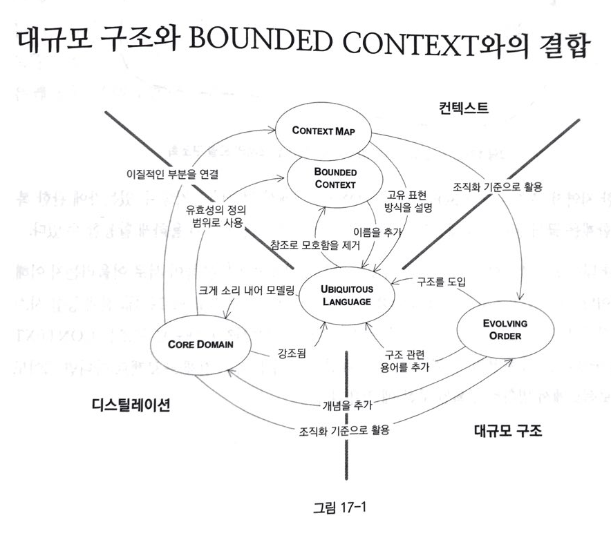
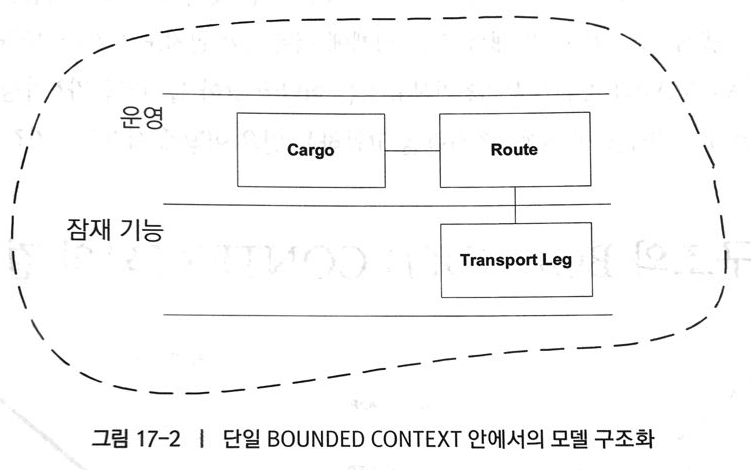
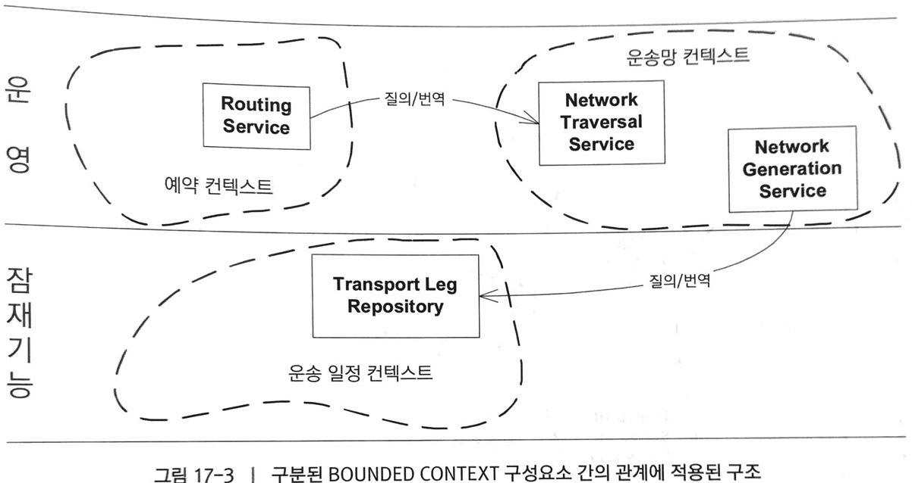
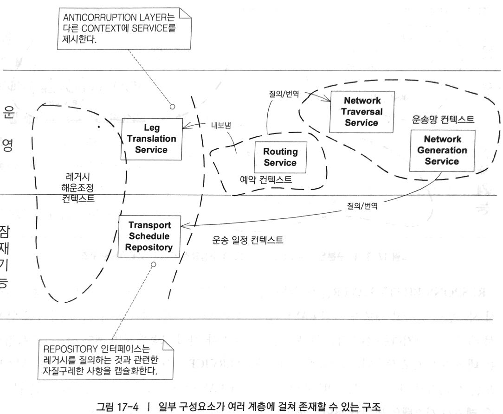
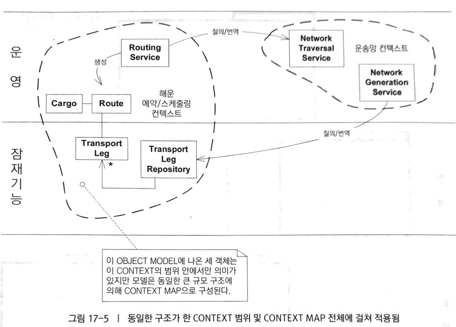
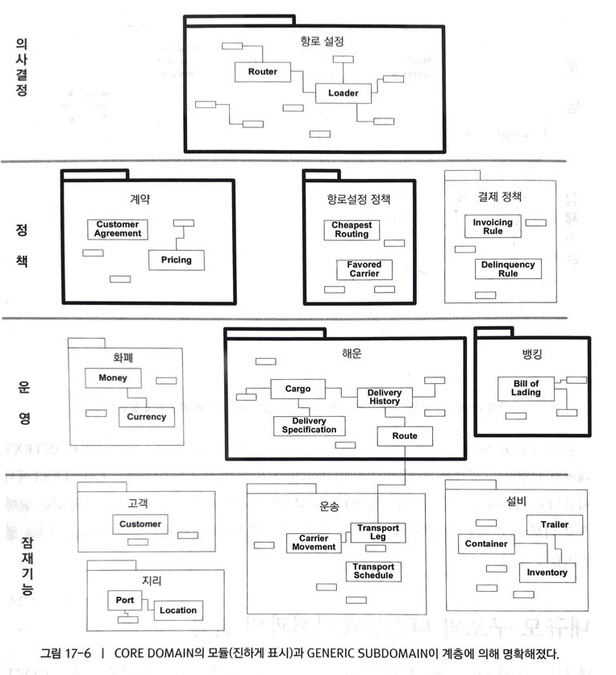

# 전략의 종합
## 대규모 구조와 BOUNDED CONTEXT의 결합

> 전략적 설계의 세가지 기본 원칙(`컨텍스트`, `디스틸레이션`, `대규모 구조`)는 서로 보완하며 상호작용한다. 

> 위의 지역적 구조는 대단히 **복잡**하지만 **단일화된 모델**에서 유용하게 사용.

> RESPONSIBILITY LAYER를 도입하고 싶지만 원하는 대규모 구조와 구성이 맞지 않는 레거시시스템이 있다면, 레거시의 실질적인 부분은 인정하자. 레거시에서 제공하는 SERVICE가 특정 LAYER에만 영향을 미칠지라도 레거시 시스템의 **범위**와 **역할**의 핵심 측면을 간결하게 서술하자.

> FACADE를 거쳐 레거시에 접근한다면 FACADE에서 제공하는 각 SERVICE를 한 계층에 맞아 떨어지게끔 설계할 수 있을지도 모른다.

> 각 BOUNDED CONTEXT는 그 자체로 이름공간이므로 한 구조는 하나의 CONTEXT 내에서 모델을 구성하는 데 사용될 수 있으며, 또 다른 구조는 이웃하는 CONTEXT에서 사용되고 또 다른 구조는 CONTEXT MAP을 구성할 수 있다. 만약 이런 방식으로 너무 치우치면 프로젝트의 단일화된 개념집합으로서 대규모 구조가 가진 가치를 떨어뜨림.

#### 대규모 구조와 디스틸레이션의 결합
대규모 구조와 디스틸레이션의 개념도 상호보완적인 관계

> 대규모 구조 자체도 CORE DOMAIN의 중요한 부분일지 모른다. **잠재기능, 운영, 정책, 의사결정 지원**으로 `계층화` 하는 것을 파악하다보면 소프트웨어에서 다루는 업무 관련 문제의 근간이 되는 **통찰력**을 얻는다. 이런 통찰력은 특히 프로젝트가 여러 BOUNDE CONTEXT로 분할되어있을때 유용한데, 결과적으로 CORE DOMAIN의 모델 객체는 프로젝트 상당 부분에 걸쳐 많은 의미를 갖지 않는다.

### 평가 먼저
프로젝트를 시작하기에 앞서 현재 상황을 명확하게 평가하는 것이 중요한데, 이러한 질문들은 완벽한 답을 찾을 순 없지만, 견실한 출발점을 제공한다. 
1. CONTEXT MAP을 그려라. 일관된 `CONTEXT MAP` 을 그릴수 있는가? 
2. 프로젝트 상의 언어를 쓰는데 힘써라. `UBIQUITOUS LANGUAGE`
3. 무엇이 중요한지 인식해라. `CORE DOMAIN` 을 식별했는가?
4. 프로젝트에 사용하는 기술이 `MODEL-DRIVEN-DISIGN` 에 유리한가?
5. 팀 내 개발자가 필요한 기술역량을 갖추었는가?
6. 개발자들이 도메인을 잘 알고 있는가? 혹은 관심이 있는가?

### 누가 전략을 세우는가?

#### 애플리케이션 개발에서 창발하는 구조
자기 훈련을 행하는 팀은 중앙 통제 없이도 운영되고 `EVOLVING ORDER`에 따라 공유하는 일련의 원칙에 도달, 따라서 질서가 명령에 의해서가 아니라 **유기적으로 성장**
비공식 리더가 **중재자**이자 **전달자** 이면서 실천적인 **개발자**일때 효과적이다.

#### 고객(애플리케이션 개발팀) 중심의 아키텍처 팀
아키텍처 팀원은 개발자들과 함께 패턴을 발견하고 디스틸레이션에 도달하고자 실험하면서 궃은 일에 직접 나서는, 개발팀의 진정한 **협력자**이다.

### 전략척 설계 결정을 위한 6가지 필수 요소
- `의사결정`은 팀 **전체**에 퍼져야 한다 : 팀원이 전략을 알지못해 따르지 않는다면 잘못된 것.
- 의사결정 프로세스는 **피드백**을 흡수해야 한다 : 디스틸레이션을 만들기 위해 프로젝트의 요구와 도멘의 개념을 진정으로 깊게 이해해야한다. 
- 계획은 **발전**을 감안해야한다 : 효과적인 소프트웨어 개발은 매우 동적인 프로세스, 강력한 피드백과 애플리케이션을 구축하는 과정에서 만나는 장애물을 만났을 때, **혁신**이 일어난다. 
- 아키텍처팀에서 뛰어난 사람들을 모두 데려가서는 안된다 : 효과적인 전략팀에는 효과적인 애플리케이션 팀이 있어야 한다. 최악의 경우 기술적으로 부족한 개발자가 실제 어플리케이션을 구축하는 상황이 나타난다.
- 전략적 설계에는 **최소주의**와 `겸손`이 필요하다 : 나의 가장 좋은 생각이 누군가에게는 방해가 될수도 잇으니 겸손이 필요하다.
- 객체는 **전문가**, 개발자는 다방면에 **지식이 풍부한 사람**이 되어야 한다.

### 기술 프레임워크도 마찬가지다
기술 프레임워크는 인프라스트럭처 계층을 제공하고 도메인을 다른 관심사에서 **격리**되게 도와줌으로써 개발속도를 빠르게 향상시킬수 있다.
하지만

> 아키텍처가 도메인 모델에 대한 표현력 있는 구현과 손쉬운 변경을 방해할수 있다.

#### 멍청이들을 위한 프레임워크를 작성하지 마라
프레임워크 설계자가 해당 프레임워크의 사용자를 상당히 존중하는 듯 하다면 그 설계자는 올바른 길로 가는중인 것이다.

#### 종합계획을 조심하라
종합계획에 의한 전체성은 너무나도 정확하지만 세부사항은 충분히 정확하지 못하다. 점진적인 성장 행위에 적용할 일련의 원칙을 지지하고, 그 결과 환경에도 잘 적응하는 `유기적질서`가 나타난다.

