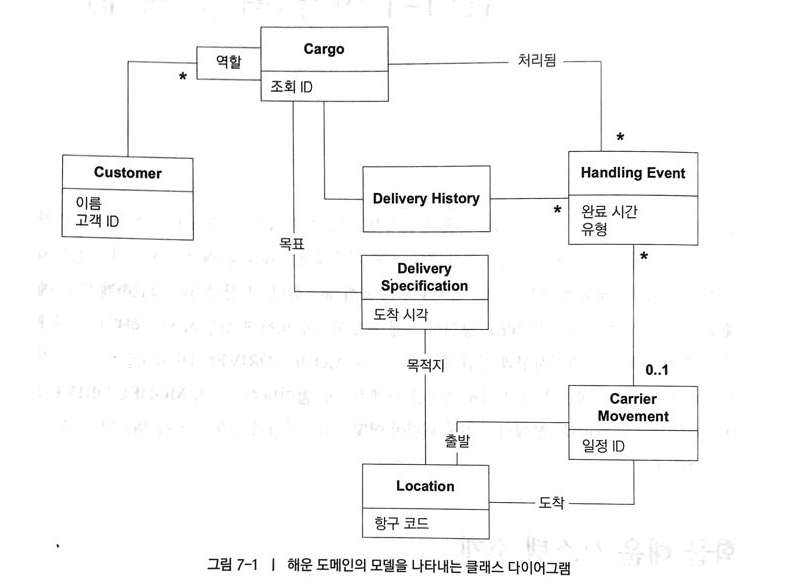

# 언어의 사용(확장 예제)

### 화물 해운 시스템 소개

요구사항 

1. 고객 화물의 주요 처리상황 추적
2. 화물 사전 예약
3. 화물이 일정한 지점에 도착할때 자동으로 고객에게 송장 발송

### ENTITY와 VALUE OBJECT의 구분

- Customer : Customer객체는 그것을 사용하는 사람에게 중요한 **식별성**을 지니고 있으므로 **모델내에서 ENTITY**에 해당한다.
- Cargo : 두 개의 동일한 컨테이너를 서로 **구분**할 수 있어야 하므로 **ENTITY**다. 실제로 모든 해운회사에서는 각 화물에 조회 ID를 할당한다.
- Handling event와 Carrier movement : 개별 사건은 현실세계의 사건을 반영하며, 대개 서로 교환할 수 없으므로 **ENTITY**에 해당한다. 각 Carrier Movement는 해운 일정에서 획득한 코드로 식별될 것이다. (도메인 전문가와 한번더 논의를 거쳐 CargoID와 완료시간, 화물 요형을 조합하면 Handling Event의 복합키로 식별할 수 있다는 사실을 알게 되었다.)
- Location : 정확한 경도와 위도를 유일한 키로 사용할 수는 있겠지만 현재 시스템의 목적에는 맞지 않는다. Location은 해운 항로를 비롯한 기타 도메인에 특화된 관심사에 따라 장소를 지정하는 지리학적 모델의 일부가 될 것이다. 이 경우에는 자동으로 생성되는 random하고 내부적인 **식별자**로 충분하다.
- Delivery History : 서로 **대체할 수 없으**므로 **ENTITY**에 해당한다. 다만, ID는 그것을 소유한 Cargo에게서 가져온 것이다.이는 AGGREGATE를 모델링할 때 분명해진다.
- Delivery Specification : Cargo의 목표를 나타내지만 Cargo에 dependent 하지는 않다. 실제로 DeliverySpecification은  DeliveryHistory의 **가상적인 상태**를 나타낸다. Cargo의 DeliveryHistory가 결국은 DeliverySpecification을 충족한다.(배송지에 도착 했을 때, 두 데이터는 같다.) 
만약, 두 개의 Cargo 배송지가 동일하다면 DeliverySpecification을 공유할 수는 있지만, DeliveryHistory는 공유할 수 없을 것이다. 그러므로 **VALUE OBJECT** 이다.
- 그밖의 **날짜나 시간 이름**과 같은 속성은 **VALUE OBJECT** 이다.

