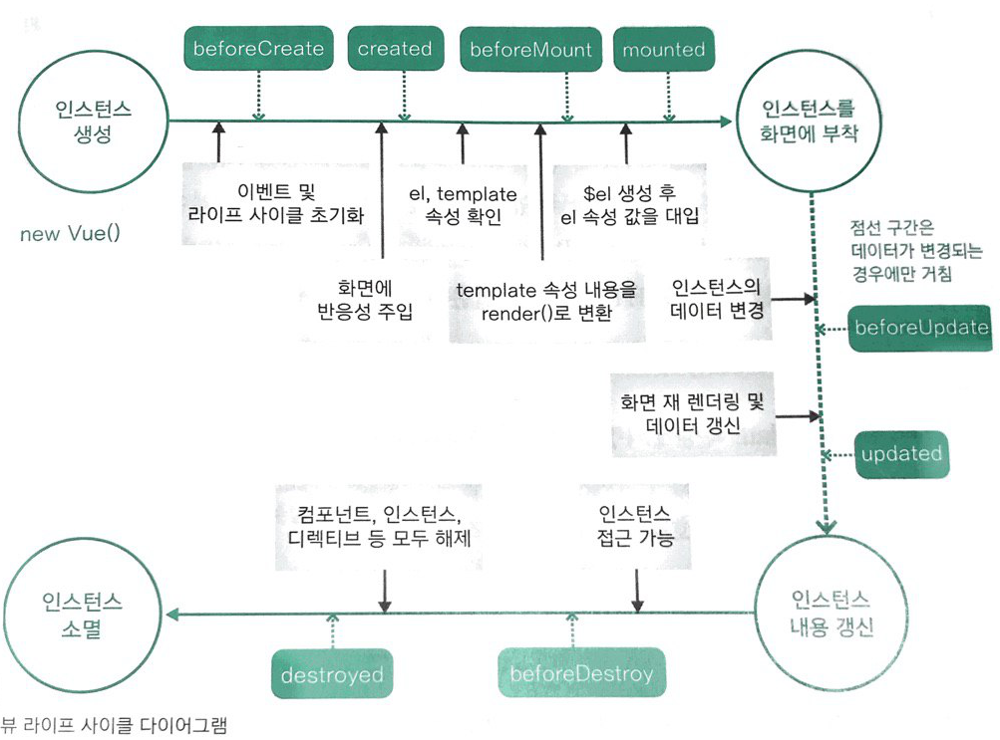

## 뷰 인스턴스 
- 뷰 인스턴스 생성자를 통해 아래와 같이 생성

```javascript
new Vue({
	...
});
```
### 뷰 인스턴스 옵션 속성
- data : 뷰에 그려질 데이터를 정의
- el : 뷰로 만든 화면이 그려지는 시작점
- template : 화면에 표시할 HTML, CSS 등의 마크업 요소를 정의하는 속성
- methods : 화면 로직 제어와 관계된 메서드를 정의하는 속성
- created : 뷰인스턴스가 생성되자 마자 실행할 로직을 정의할 수 있는 속성

### 뷰 인스턴스의 유효범위

인스턴스 적용 순서

1. 뷰 라이브러리 파일 로딩
2. 인스턴스 객체 생성(옵션 포함)
3. 특정 화면 요소에 인스턴스 붙임.
4. 인스턴스 내용이 화면 요소로 변환
5. 변환된 화면 요소를 사용자가 최종 확인

인스턴스의 유효 범위는 el 로 정의한 태그 범위

### 뷰 인스턴스 라이프 사이클



- beforeCreate : 인스턴스가 생성되고 가장 처음, data속성과 methods 속성이 아직 인스턴스에 정의되지 않고, DOM에도 접근 불가
- created : data와 methods가 정의되었으므로, this.data, this.fetchData() 와 같은 로직을 수행하기 좋음, DOM에 접근 불가
- beforeMount : render()함수로 변환후 el 속성에 지정한 화면 요소에 인스턴스를 부착하기 전
- mounted : el 속성에 인스턴스가 부착된 후, 화면 요소를 제어하는 로직을 수행하기 좋음.
- beforeUpdate : 데이터가 변경되면 가상 돔으로 화면을 다시 그리기 전에 호출되는 단계, 변경 예정인 데이터에 접근 가능
- updated : 데이터 변경 이후 가상 DOM으로 다시 화면을 그리는 단계
- beforeDestroy : 뷰 인스턴스가 삭제되기 전 단계, 데이터를 삭제하기 좋음.
- destroyed : 뷰 인스턴스가 삭제되고 난 후 호출됨.

```html
<html>
  <head>
    <title>Vue Instance Lifecycle</title>
  </head>
  <body>
    <div id="app">
      {{ message }}
    </div>

    <script src="https://cdn.jsdelivr.net/npm/vue@2.5.2/dist/vue.js"></script>
    <script>
      new Vue({
        el: '#app',
        data: {
          message: 'Hello Vue.js!'
        },
        beforeCreate: function() {
          console.log("beforeCreate");
        },
        created: function() {
          console.log("created");
        },
        mounted: function() {
          console.log("mounted");
        },
        updated: function() {
          console.log("updated");
        }
      });
    </script>
  </body>
</html>
```

## 뷰 컴포넌트
화면을 구성할 수 있는 블록을 의미

### 전역 컴포넌트 
- 뷰 라이브러리를 로딩하고 나면 접근 가능한 Vue 변수를 이용하여 등록.

```javascript
Vue.component('컴포넌트 이름', {
	// 컴포넌트 내용
});
```
예제

```html
<html>
<head>
	<title>Vue Component Registration</title>
</head>
<body>
<div id="app">
	<button>컴포넌트 등록</button>
	<my-component></my-component>
</div>

<script>
	Vue.Component('my-component', {
		template: '<div>전역 컴포넌트가 등록되었습니다.</div>'
	});

	new Vue({
		el : '#app'
	});
</script>
</body>
</html>
```
### 지역 컴포넌트

```javascript
new Vue({
	components: {
		'컴포넌트 이름' : 컴포넌트 내용
	}
});
```
예를 들면,

```html
<html>
  <head>
    <title>Vue Component Registration</title>
  </head>
  <body>
    <div id="app">
      <button>컴포넌트 등록</button>
			<my-component></my-component>
    </div>

    <script src="https://cdn.jsdelivr.net/npm/vue@2.5.2/dist/vue.js"></script>
    <script>
      Vue.component('my-component', {
        template: '<div>전역 컴포넌트가 등록되었습니다!</div>'
      });
      new Vue({
        el: '#app'
      });
    </script>
  </body>
</html>
```


### 지역 컴포넌트와 전역 컴포넌트의 차이
유효 범위의 차이

- 예를 들면
```html
<html>
  <head>
    <title>Vue Local and Global Components</title>
  </head>
  <body>
    <div id="app">
      <h3>첫 번째 인스턴스 영역</h3>
      <my-global-component></my-global-component>
      <my-local-component></my-local-component>
    </div>

    <script src="https://cdn.jsdelivr.net/npm/vue@2.5.2/dist/vue.js"></script>
    <script>
      // 전역 컴포넌트 등록
      Vue.component('my-global-component', {
        template: '<div>전역 컴포넌트 입니다.</div>'
      });
      // 지역 컴포넌트 내용
      var cmp = {
        template: '<div>지역 컴포넌트 입니다.</div>'
      };
      new Vue({
        el: '#app',
        // 지역 컴포넌트 등록
        components: {
          'my-local-component': cmp
        }
      });
    </script>
  </body>
</html>
```

## 뷰 컴포넌트 통신

### 상위에서 하위 컴포넌트로 데이터 전달하기
- props 속성을 이용.

```javascript
Vue.component('child-component', {
	props: ['prop 속성 이름'],
});
```
```html
<child-component v-bind:props 속성 이름="상위 컴포넌트의 data속성 "></child-component>
```

예를 들면
```html
<html>
  <head>
    <meta charset="utf-8">
    <meta name="viewport" content="width=device-width, initial-scale=1.0">
    <title>Vue Props Sample</title>
  </head>
  <body>
    <div id="app">
      <!-- 팁 : 오른쪽에서 왼쪽으로 속성을 읽으면 더 수월합니다. -->
      <child-component v-bind:propsdata="message"></child-component>
    </div>

    <script src="https://cdn.jsdelivr.net/npm/vue@2.5.2/dist/vue.js"></script>
    <script>
      Vue.component('child-component', {
        props: ['propsdata'],
        template: '<p>{{ propsdata }}</p>',
      });
      new Vue({
        el: '#app',
        data: {
          message: 'Hello Vue! passed from Parent Component'
        }
      });
    </script>
  </body>
</html>
```

### 하위에서 상위 컴포넌트로 이벤트 전들하기
하위에서 상위 컴포넌트로 데이터를 전달하기 위해서 이벤트를 발생하여 상위 컴포넌트에 신호를 보내면 됨.  
`v-on:click="showLog"` 는 `@click="showLog"`  와 같음

```javascript
this.$emit('이벤트명');
```
```html
<child-component v-on:이벤트명="상위 컴포넌트의 메서드 명"></child-component>
<child-component @이벤트명="상위 컴포넌트의 메서드 명"></child-component>
```
예를 들면, 
```html
<html>
  <head>
    <meta charset="utf-8">
    <meta name="viewport" content="width=device-width, initial-scale=1.0">
    <title>Vue Event Emit Sample</title>
  </head>
  <body>
    <div id="app">
      <child-component v-on:show-log="printText"></child-component>
    </div>

    <script src="https://cdn.jsdelivr.net/npm/vue@2.5.2/dist/vue.js"></script>
    <script>
      Vue.component('child-component', {
        template: '<button v-on:click="showLog">show</button>',
        methods: {
          showLog: function() {
            this.$emit('show-log');
          }
        }
      });
      new Vue({
        el: '#app',
        data: {
          message: 'Hello Vue! passed from Parent Component'
        },
        methods: {
          printText: function() {
            console.log("received an event");
          }
        }
      });
    </script>
  </body>
</html>
```

### 관계없는 컴포넌트간 통신 - 이벤트 버스

```javascript

//이벤트를 보내는 컴포넌트 
methods : {
	메소드명 : function() {
		eventBus.$emit('이벤트명', 데이터);
	}
}

//이벤트를 받는 컴포넌트
methods: {
	created : function() {
		eventBus.$on('이벤트명', function(데이터) {
			...
		});
	}
}
```

## 뷰 라우터
뷰에서 라우팅 기능을 구현할 수 있도록 지원하는 공식 라이브러리

| 태그 | 설명 |
|:--------|:--------|
| `<router-link to="URL 값">` | 페이지로 이동 태그. 화면에서는 `<a>` 로 표시되며 클릭하면 to에 지정한 URL로 이동합니다. |
| `<router-view>` | 페이지 표시 태그. 변경되는 URL에 따라 해당 컴포넌트에 뿌려주는 영역 |

예제
```html
<html>
  <head>
    <meta charset="utf-8">
    <meta name="viewport" content="width=device-width, initial-scale=1.0">
    <title>Vue Router Sample</title>
  </head>
  <body>
    <div id="app">
      <h1>뷰 라우터 예제</h1>
      <p>
        <router-link to="/main">Main 컴포넌트로 이동</router-link>
        <router-link to="/login">Login 컴포넌트로 이동</router-link>
      </p>
      <router-view></router-view>
    </div>

    <script src="https://cdn.jsdelivr.net/npm/vue@2.5.2/dist/vue.js"></script>
    <script src="https://unpkg.com/vue-router@3.0.1/dist/vue-router.js"></script>
    <script>
      // 3. Main. Login 컴포넌트 내용 정의
      var Main = { template: '<div>main</div>' };
      var Login = { template: '<div>login</div>' };
      // 4. 각 url에 해당하는 컴포넌트 등록
      var routes = [
        { path: '/main', component: Main },
        { path: '/login', component: Login }
      ];
      // 5. 뷰 라우터 정의
      var router = new VueRouter({
        routes
      });
      // 6. 뷰 라우터를 인스턴스에 등록
      var app = new Vue({
        router
      }).$mount('#app');
    </script>
  </body>
</html>

```

**$mount()** API 란?  
Vue 인스턴스의 el 와 같이 인스턴스를 화면에 붙이는 역할을 하는데, 뷰라우터 공식 문서에는 모든 인스턴스에 el을 지정하지 않고 라우터만 지정하여 생성한 다음 생성된 인스턴스를 $mount()를 이용하여 붙이는 식으로 안내하고 있음.

라우터 URL의 해시 값(#)을 없애는 방법
- history 모드를 활용
```javascript
var router= new VueRouter({
	mode: 'history',
	routes
});
```


### 네스티드 라우터
- 라우터로 페이지 이동시 최소 2개 이상의 컴포넌트를 화면에 표시하기 위한 라우터
예제
```html
<html>
  <head>
    <meta charset="utf-8">
    <meta name="viewport" content="width=device-width, initial-scale=1.0">
    <title>Vue Nested Router</title>
  </head>
  <body>
    <div id="app">
      <router-view></router-view>
    </div>

    <script src="https://cdn.jsdelivr.net/npm/vue@2.5.2/dist/vue.js"></script>
    <script src="https://unpkg.com/vue-router@3.0.1/dist/vue-router.js"></script>
    <script>
      var User = {
        template: `
          <div>
            User Component
            <router-view></router-view>
          </div>
        `
      };
      var UserProfile = { template: '<p>User Profile Component</p>' };
      var UserPost = { template: '<p>User Post Component</p>' };
      var routes = [
        {
          path: '/user',
          component: User,
          children: [
            {
              path: 'posts',
              component: UserPost
            },
            {
              path: 'profile',
              component: UserProfile
            },
          ]
        }
      ];
      var router = new VueRouter({
        routes
      });
      var app = new Vue({
        router
      }).$mount('#app');
    </script>
  </body>
</html>
```


### 네임드 뷰
- 특정 페이지로 이동 했을 때, 여러 개의 컴포넌트를 동시에 표시하는 라우팅 방법

예제
```html
<html>
  <head>
    <meta charset="utf-8">
    <meta name="viewport" content="width=device-width, initial-scale=1.0">
    <title>Vue Named View Sample</title>
  </head>
  <body>
    <div id="app">
      <router-view name="header"></router-view>
      <router-view></router-view>
      <router-view name="footer"></router-view>
    </div>

    <script src="https://cdn.jsdelivr.net/npm/vue@2.5.2/dist/vue.js"></script>
    <script src="https://unpkg.com/vue-router@3.0.1/dist/vue-router.js"></script>
    <script>
      var Body = { template: '<div>This is Body</div>' };
      var Header = { template: '<div>This is Header</div>' };
      var Footer = { template: '<div>This is Footer</div>' };
      var router = new VueRouter({
        routes: [
          {
            path: '/',
            components: {
              default: Body,
              header: Header,
              footer: Footer
            }
          }
        ]
      })
      var app = new Vue({
        router
      }).$mount('#app');
    </script>
  </body>
</html>


```

## 뷰 http 통신


### 뷰 리소스
- 현재는 잘 사용하지 않음

### 액시오스
- 뷰 커뮤니티에서 가장 많이 사용되는 http 통신 라이브러리
- promise 기반의 API

```html
<html>
  <head>
    <title>Vue with Axios Sample</title>
  </head>
  <body>
    <div id="app">
      <button v-on:click="getData">프레임워크 목록 가져오기</button>
    </div>
    <script src="https://cdn.jsdelivr.net/npm/vue@2.5.2/dist/vue.js"></script>
    <script src="https://unpkg.com/axios/dist/axios.min.js"></script>
    <script>
      new Vue({
      	el: '#app',
      	methods: {
      		getData: function() {
      			axios.get('https://raw.githubusercontent.com/joshua1988/doit-vuejs/master/data/demo.json')
      				.then(function(response) {
      					console.log(response);
      				});
      		}
      	}
      });
    </script>
  </body>
</html>
```

## 뷰 템플릿
HTML, CSS 등의 마크업 속성과 뷰 인스턴스에서 정의한 데이터 및 뷰 로직을 정의하여 HTML로 변환해주는 속성

- 템플릿 속성을 사용한 경우와 사용하지 않은 경우

| 템플릿을 사용하지 않은 경우 | 템플릿을 사용한 경우 |
|:--------|:--------|
| 먼저 `<h3>{{message}}</h3>` 를 표현하고 데이터를 render | `<div id="app"></div>` 만 노출하다가 인스턴스가 생성되면 그때 `<h3>Hello!</h3>` 를 노출 |

### 데이터 바인딩 
주로 {{}} 과 v-bind 이 존재

#### {{}} 콧수염 괄호
- 가장 많이 사용하는 방법

```html
<div id="app">
  <h1>{{message}}</h1>
</div>
```

만약 처음 한번만 데이터를 바인딩하고 싶다면 `v-once` 속성을 추가.
```html
<div id="app" v-once>
  <h1>{{message}}</h1>
</div>
```

#### v-bind
아이디, 클래스, 스타일 등의 html 속성에 데이터를 연결할 때 사용.
```html
<div id="app" v-once>
  <p v-bind:id="idA">아이디 바인딩</p>
  <p v-bind:class="classA">클래스 바인딩</p>
  <p v-bind:style="styleA">스타일 바인딩</p>
</div>
<script>
new Vue({
  el : '#app',
  data : {
    idA: 10,
    classA : 'container',
    styleA : 'color:blue'
  }
});
</script>
```
- `v-bind:id` 는 `:id` 로 축약할 수 있는데, 가급적 `v-` prefix를 사용하자.

### 디렉티브
HTML 안에서 `v-` prefix를 가진 모든 속성을 말한다.

| 디렉티브 이름 | 역할 |
|:--------|:--------|
| `v-if` | 지정한 뷰 데이터 값의 참 거짓 여부에 따라 html에 표현할 값이 다를 경우 사용 |
| `v-for` | 데이터의 갯수만큼 iterate하여 html에 표현할 경우 사용 |
| `v-show` | `v-if` 와 비슷하지만, `v-show`는 style 에 `display:none;` 을 사용하여 화면상으로만 보이지 않게 할 경우 사용. |
| `v-bind` | html 태그의 기본속성과 데이터 속성을 연결 |
| `v-on` | 이벤트를 감지할 때 사용 |
| `v-model` | 폼에 주로 사용하며, 입력한 값을 즉시 뷰 인스턴스의 데이터값과 동기화 할때 사용.`<input>`, `<select>`, `<textarea>` 태그에만 사용 가능 |

> 사실 앵귤러의 디렉트비와 비슷한 역할을 하며, 사용자가 직접 돔 요소에 접근하여 뭔가를 하지 않도록 하기 위해 디렉티브를 사용하도록 권장함.

### 이벤트 처리
`v-on` 으로 이벤트를 바인딩 하며, event 인자를 이용해 돔 이벤트에 아래와 같이 접근 가능하다. 
```html
<div id="app">
  <button v-on:click="click(10)">클릭</button>
</div>
<script>
new Vue({
  el : '#app',
  methods : {
    click: function(num) {
      alert(num);
    },
    click: function(event) {
      console.log(event);
    }
  }
});
</script>
```

#### computed 속성
- data에 따라 자동으로 연산 및 캐싱.
- methods 속성은 호출할 때만 수행하지만 computed 속성은 데이터가 변경되면 자동 수행.

```html
<div id="app">
  <p>{{reversedMessage}}</p>
</div>
<script>
new Vue({
  el : '#app',
  data : {
    message : 'hello~'
  },
  computed : {
    reversedMessage : function() {
      return this.message.split('').reverse().join('');
    }
  }
});
</script>
```

#### watch 속성
- 데이터 변환을 감지하여 자동으로 특정 로직 수행

```html
<div id="app">
  <input v-model="message">
</div>
<script>
new Vue({

  el : '#app',
  data : {
    message : 'hello~'
  },
  watch : {
    message : function(data) {
      console.log('message의 값이 바뀝니다. : ');
    }
  }
});
</script>
```
## Vuex
- 여러 컴포넌트에서 전역적으로 상태<sup>데이터이지만, 영속화되지 않는 데이터</sup>를 공유하기 위한 상태관리 패턴 + 라이브러리.
- 단순한 저장소라고 보면 될 것 같음. 아래와 같이 구현
```javascript
// 모듈 시스템을 사용하는 경우 Vue.use(Vuex)를 먼저 호출해야합니다.

const store = new Vuex.Store({
  state: {
    count: 0
  },
  mutations: {
    increment (state) {
      state.count++
    }
  }
})

store.commit('increment')

console.log(store.state.count) // -> 1


// Counter 컴포넌트를 만듭니다
const Counter = {
  template: `<div>{{ count }}</div>`,
  computed: {
    count () {
      return this.$store.state.count
    }
  }
}
```

### [State](https://vuex.vuejs.org/kr/guide/state.html)
- Vuex 저장소는 반응적이기<sup>reactive</sup> 때문에 저장소에서 상태를 `검색` 하는 가장 간단한 방법은 계산된 속성내에서<sup>computed</sup> 일부 저장소 상태를 가져오는 방법.
- `mapState` : Vuex 의 state에 접근하는 것을 도와주는 helper.(boilerplate 코드를 줄여 줌.)
- `Object Spread Operator` 라고 불리는 `...` 연산자를 통해 기존의 computed 속성들에 mapState 속성도 함께 다룰 수 있다. 아래와 같이...
```javascript
export default {
  name: 'HelloWorld',
  computed: {
    ...mapState([
      'title'
    ]),
    // Other properties
  }
}
```

### Getters
- State로도 충분히 좋은데, 만약 vuex에서 뭔가 연산된 결과를 가져오고 싶다면 `Getter`를 사용해야 함.
- 아래는 state 에서 links라는 값에 접근하여 length를 구하는 Getter인데, 이것을 만약 state로 구현한다면, 사용하는 모든 코드에서 `this.$state.links.length` 와 같이 접근해야 할 것이다.
```javascript
  state: {
    // Code removed for brevity
  },
  getters: {
    countLinks: state => {
      return state.links.length
    }
  },
  mutations: {},
  actions: {}
```
- 아래와 같이 client 코드에서 간결하게 사용할 수 있다.
```javascript
<template>
  <div class="stats">
    <h1>A different component</h1>
    <p>There are currently {{ countLinks }} links</p>
  </div>
</template>

<script>
import { mapGetters } from 'vuex'

export default {
  name: 'Stats',
  computed: {
    ...mapGetters([
      'countLinks'
    ]),
  }
}
</script>
```

### Mutations
- state에 값을 저장하기 위한 helper. 선언은 아래와 같이 함.
```javascript
  mutations: {
    ADD_LINK: (state, link) => {
      state.links.push(link)
    }
  },
```
- 그리고 사용은 아래와 같이...

```javascript
<script>
import Stats from '@/components/Stats.vue'
import { mapState, mapMutations } from 'vuex'  // Add mapMutations

export default {
  name: 'HelloWorld',
  data() {                                     // Add this:
    return {
      newLink: ''
    }
  },
  components: {}, // Removed for brevity
  computed: {}, // Removed for brevity
  methods: {                                   // Add this:
    ...mapMutations([
      'ADD_LINK'
    ]),
    addLink: function() {
      this.ADD_LINK(this.newLink)
      this.newLink = ''
    }
  }
}
</script>
```

### Actions
- mutations를 사용하여 데이터를 저장하는 것은 동기 이벤트이다. 비동기가 필요하다면 Actions 를 사용하면 되는데, 아래와 같이 정의.
```javascript
  mutations: {
    ADD_LINK: (state, link) => {
      state.links.push(link)
    },
    REMOVE_LINK: (state, link) => {        // Add this:
      state.links.splice(link, 1)
    }
  },
   actions: {
    removeLink: (context, link) => {
      context.commit("REMOVE_LINK", link)
    },
    removeAll ({commit}) {                       // Add this
      return new Promise((resolve, reject) => {
        setTimeout(() => {
          commit('REMOVE_ALL')
          resolve()
        }, 1500)
      })
    }
  }
```
- 사용할 때는, 아래와 같이 사용한다.
```javascript
  methods: {
    ...mapMutations(['REMOVE_ALL']),
    ...mapActions(['removeAll']),
    removeAllLinks() {
      this.removeAll().then(() => {
        this.msg = 'They have been removed'
      });
    }
  }

```
- 위와 같이 removeAllLinks 가 비동기로 실행된다.