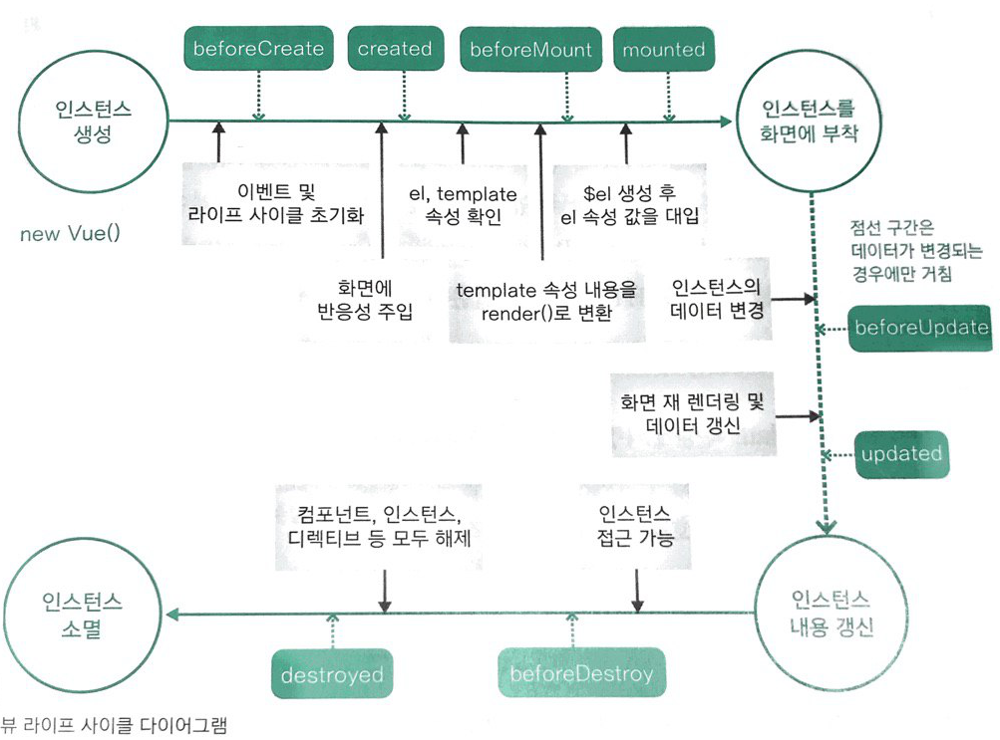

# 3. 화면을 개발하기 위한 필수단위 인스턴스 & 컴포넌트

## 3.1 뷰 인스턴스 
- 뷰 인스턴스 생성자를 통해 아래와 같이 생성

```javascript
new Vue({
	...
	});
```
### 뷰 인스턴스 옵션 속성
- data : 뷰에 그려질 데이터를 정의
- el : 뷰로 만든 화면이 그려지는 시작점
- template : 화면에 표시할 HTML, CSS 등의 마크업 요소를 정의하는 속성
- methods : 화면 로직 제어와 관계된 메서드를 정의하는 속성
- created : 뷰인스턴스가 생성되자 마자 실행할 로직을 정의할 수 있는 속성

### 뷰 인스턴스의 유효범위

인스턴스 적용 순서 
1. 뷰 라이브러리 파일 로딩
2. 인스턴스 객체 생성(옵션 포함)
3. 특정 화면 요소에 인스턴스 붙임.
4. 인스턴스 내용이 화면 요소로 변환
5. 변환된 화면 요소를 사용자가 최종 확인

인스턴스의 유효 범위는 el 로 정의한 태그 범위

### 뷰 인스턴스 라이프 사이클



- beforeCreate : 인스턴스가 생성되고 가장 처음, data속성과 methods 속성이 아직 인스턴스에 정의되지 않고, DOM에도 접근 불가
- created : data와 methods가 정의되었으므로, this.data, this.fetchData() 와 같은 로직을 수행하기 좋음, DOM에 접근 불가
- beforeMount : render()함수로 변환후 el 속성에 지정한 화면 요소에 인스턴스를 부착하기 전
- mounted : el 속성에 인스턴스가 부착된 후, 화면 요소를 제어하는 로직을 수행하기 좋음.
- beforeUpdate : 데이터가 변경되면 가상 돔으로 화면을 다시 그리기 전에 호출되는 단계, 변경 예정인 데이터에 접근 가능
- updated : 데이터 변경 이후 가상 DOM으로 다시 화면을 그리는 단계
- beforeDestroy : 뷰 인스턴스가 삭제되기 전 단계, 데이터를 삭제하기 좋음.
- destroyed : 뷰 인스턴스가 삭제되고 난 후 호출됨.

## 3.2 뷰 컴포넌트
화면을 구성할 수 있는 블록을 의미

### 전역 컴포넌트 
- 뷰 라이브러리를 로딩하고 나면 접근 가능한 Vue 변수를 이용하여 등록.

```javascript
Vue.component('컴포넌트 이름', {
	// 컴포넌트 내용
});
```
예제

```html
<html>
<head>
	<title>Vue Component Registration</title>
</head>
<body>
<div id="app">
	<button>컴포넌트 등록</button>
	<my-component></my-component>
</div>

<script>
	Vue.Component('my-component', {
		template: '<div>전역 컴포넌트가 등록되었습니다.</div>'
	});

	new Vue({
		el : '#app'
	});
</script>
</body>
</html>
```
### 지역 컴포넌트

```javascript
new Vue({
	components: {
		'컴포넌트 이름' : 컴포넌트 내용
	}
});
```

### 지역 컴포넌트와 전역 컴포넌트의 차이
- 유효 범위의 차이

## 3.3 뷰 컴포넌트 통신
작성중...


